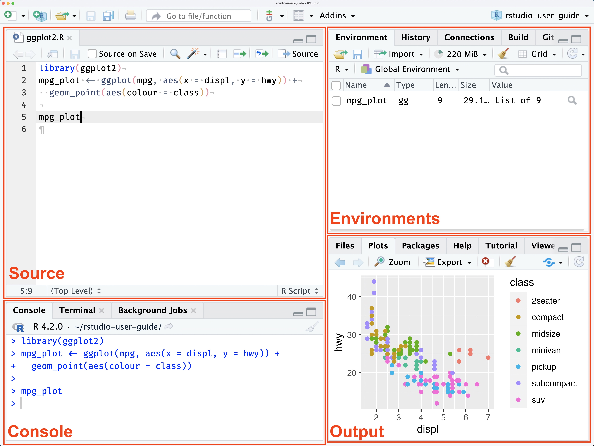
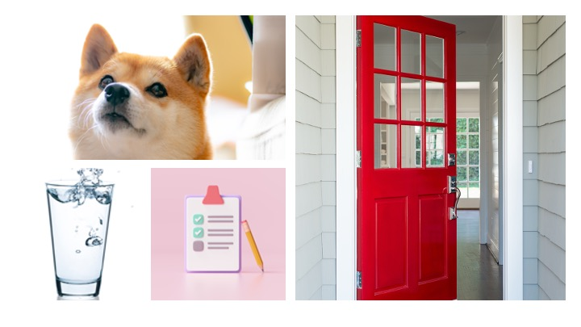

```{r setup, include=FALSE}
knitr::opts_chunk$set(echo = TRUE)
```

# Learning Outcomes

In this Session of our R Workshop, we will cover the following introductory aspects of R Studio & Programming:

-   R vs. RStudio
-   RStudio Environment
-   Notebooks & Scripts
-   Variables & Data Types
-   Anatomy of Base R Functions
-   Data Structures
-   Operators

By the end of this Session, you will understand:

1.  The difference between R and RStudio
2.  The default layout of the RStudio Environment
3.  What a variable is and how to declare one
4.  Basic anatomy of a function in R
5.  Basic data types available in R
6.  Basic data structures and how to access the data in them
7.  What an operator is and some available in R

# R vs. RStudio: What's the Difference?

-   R is an open-source programming language
    -   used widely for data science and statistical analysis.
-   Open-source means free to use and:
    -   Access to many libraries and packages
    -   Some tested more diligently than others
-   RStudio is an programming environment
    -   makes it easier to write and test scripts developed in R.

# RStudio Environment

There are four main window panes in RStudio: the Source, the Console, the Environments and the Output Window. [](https://docs.posit.co/ide/user/ide/guide/ui/ui-panes.html)

## Source Pane

-   Shows open scripts, Notebooks and other files you are editing.
-   The area where you can view data

We'll talk about scripts and Notebooks soon.

## Console Pane

-   Features 4 tabs:
    -   Console Tab
        -   Enter commands that run immediately
        -   Good for testing
    -   Terminal
        -   let's you interact with your computer terminal
    -   Background Jobs
        -   provides information on "background" scripts which run in a separate dedicated R session.

## Environments Pane

The Environments pane has four tabs available by default:

-   Environment
    -   Provides info about variables defined in during your session
-   History
    -   Shows all the commands you have run during your session
    -   Can be saved across sessions
    -   Can be copied to console or a script
-   Connections
    -   beyond the scope of this workshop
    -   check out [this info](https://docs.posit.co/ide/user/ide/guide/ui/ui-panes.html#connections) for more information
-   Tutorial
    -   provides access to interactive tutorials.
    -   Check them out!

## Output

The output pane has a variety of tabs that provide access to different types of output. This includes files, plots, packages, help and a couple of other specialized output types. Tabs in this pane include:

-   Files
    -   shows your file directory
    -   projects created in a directory will set the "working directory" to the directory it is stored in
    -   without a project, you may need to set a "working directory"
    -   setting a "working directory" lets you use relative path names
-   Plots
    -   this is where plots will show up when you generate them

```{r Plot_tab_example}
# Lets create a little plot
# create some data
data <- data.frame(a = c(72,41,54,36), b=c('East','West','North','South'))

# generate plot
barplot(data$a, 
        names.arg = data$b, 
        col="blue", 
        ylab="# of Regional Managers")

```

-   Packages
    -   Interface to install packages
    -   Installed packages
        -   Any package listed
    -   Loaded packages
        -   Any package with a checkmark to the left of its name
-   Help
    -   Your best friend!!
    -   You can see the details about functions you want to use
    -   use search bar in pane or type "?barplot" in console
-   Viewer
    -   Shows output for rendered notebooks
-   Presentation
    -   Shows output when you generate slides using Quarto

------------------------------------------------------------------------

## Quiz \# 1

### Where do you look for...?

1.  Where would you look for the value of a variable you set?

-   Source Pane
-   Terminal Tab in the Console Pane
-   Environment tab in the Environment Pane
-   Viewer tab in the Output Pane

2.  Where would you find the output of a plot command?

-   Plots tab of the Output pane
-   Source pane
-   History tab of the Environment pane
-   In a notebook, below the code block that generates the plot

3.  What pane is your script or notebook file open in?

-   Source pane
-   Console pane
-   Environment pane
-   Output pane

------------------------------------------------------------------------

# Notebooks & Scripts

Through RStudio, you can use and render R code in a variety of ways including:

-   Scripts
    -   These are the way most people start out.
    -   A script has a file type of .R
    -   You can easily run the entire script using the Run command
    -   Only comments and code.
-   Notebooks
    -   Great way to have text and code together
    -   Can contain text, code chunks, equations, tables
    -   Good when small bits of code are being run for a discrete task.

Even though you will probably use scripts when you start out coding, for this workshop we are going to take advantage of the ability to have readable text along side runnable code.

# Variables in R

Variables are named containers used to store information. What can we name them? Almost anything we want, according to the following rules:

-   name has to start with a letter
-   can contain any combination of letters, numbers and can include periods "."
-   can't start with an underscore, "\_"
-   are case sensitive
-   can't be any of the reserved words in R

## What R reserved words?

All programming languages have reserved words. These are words that have a specific meaning to the language itself. Some examples in R include:

-   TRUE
-   FALSE
-   NULL
-   if

You can find a list of reserved words [here](https://rdrr.io/r/base/Reserved.html).

## Will it Variable?

For a variable to be useful, you must give it a value. To set a variable to a value, you use the assignment operator. You've seen this in math, for instance, $a+b=5$. In R, to assign a value to a variable we use "\<-". We'll talk more about variables later, but now you know the assignment operator!

The code box below shows some example variables. Use CMD/CTRL + RETURN/ENTER to run a line of code.

```{r Variables}

# Set some variables
bert  <-  5
ernie <-  "Bert's Best Friend"
mrs.wuff  <-  9.732
TuFfY <-  "8/18/2025"
tuffy_2 <-  as.POSIXct("8/18/2025", format="%m/%d/%Y")
i.am.happy = TRUE # Wait, what?!?! what's with the "="?

# See the variable value
bert
ernie
```

## I Digress ...

In most programming languages, you use "=" as the assignment operator, like you see with `i.am.happy` above. While R lets you use "=", the convention is to use "\<-". This is a holdover from the language from which R is derived, S. Programmers are funny, funny people.

------------------------------------------------------------------------

## QUIZ \# 2

Using the rules listed above which of the following passwords will work?

-   My_favoritePASSWORDofAlL.tymes
-   \_favoritePW
-   PW6
-   PW6_myfav
-   6PW
-   If
-   if

```{r Quiz-2-Variables}
# Not sure which will run? 
# Use the assignment operator to assign the value 5 to a variable using the names above. Feel free to test some you define yourself!

My_favoritePASSWORDofAlL.tymes <- 5

```

------------------------------------------------------------------------

# Data Types

Data Types

-   are categories of data
-   dictate
    -   how much space a variable of that type will take
    -   determine how they are handled as input and output
    -   how you can use the variable
-   sometimes R cares about what data type you use
-   sometimes R doesn't care (e.g., is really flexible)

We'll talk about 4 main data types:

-   Numeric
-   Text
-   Date/Time
-   Logical or Boolean

## Numeric

Numeric values can be described as integers, decimals (floating point numbers) and complex. We will leave complex numbers for another day and focus on integers and decimals.

Some languages aggressively distinguish between integers (whole numbers) and floating point (decimal) values. R does not. In R, when you store a number it is loaded as a `double`. This is just another word for decimal or floating point.

In most situations, you don't have to worry about whether a number is an integer or a floating point value. However, it does recognize integers and doubles. It also has function that check or convert a number to an integer or float. Read more about numbers in R [here](https://www.burns-stat.com/documents/tutorials/impatient-r/more-r-key-objects/more-r-numbers/).

------------------------------------------------------------------------

Let's look at some examples.

```{r Integers}
# Let's set some variables to an integer.
myBelovedInteger <- -53
BigInteger <- 1500225
typeof(BigInteger)
# NoCommasReally <- -22,550,675
# Yes, really
```

> REMEMBER: computers don't need commas in numbers. That's just to make them easier to read for us humans.

```{r Doubles-no-not-tennis}

# Now we'll define some floating point variables
myPreciousFloat <- 42.5 # Even floating point numbers need love
RandomFloatIdontKnow <- 1999999999.9999999999999
swimFloaties <- -25.11235813

# stillNoCommas <- 4,325.98

trickyFloat <- 198.0 # is it an integer or is it a double?
typeof(trickyFloat) # everything is a double to R
typeof(myPreciousFloat) # yup, still a double
```

> Use the `typeof()` function to check what data type R thinks a variable is.

## Text

We've looked at the scary, scary numbers. Let's look at good old familiar text. Run the code in the block below. What data type does R see string data as? Hint: run the last line!!

```{r}
# Some text examples
myFirstString <- "String"
mySecondString <- "My second string"
anotherString <- "Is this a string or a sentence? I'm not sure..."
ughWhatNow <- 'She asked, "What if I want to put something in quotes?"'
print(ughWhatNow)
ughWhatNowPart2 <- "She asked, 'What if I want to put something in single quotes?'"
print(ughWhatNowPart2)
typeof(ughWhatNow)
```

Compare how `ughWhatNow` is printed to how `ughWhatNowPart2` is printed. What is the difference? What is with that "\\"? And why did you put two of them between quotes? And WHY does only one print in the HTML version of the notebook?!?

> Sometimes, R needs to distinguish between a character that is being used programmatically, versus one that should be a string. To distinquish between the two an escape character is used. That escape character is "". We need two in the paragraph above because the first is the escape character and the second is the character we want to print out in the final notebook.

## Dates & Times

Dates are their own special kind of special. The Date/Time data type is useful for:

-   Outputting dates so they look pretty and confirm to the style you want them to (e.g., 8/26/2025, August 26, 2025; 25/08/2025).
-   Being able to do date math: how many weeks, days, months, years between two dates, etc.

We can define a date as a string. The computer doesn't care:

```{r}
aDateButItsReallyAString <- "07/15/2025"
print(aDateButItsReallyAString)
```

Why would we want to use a date data type? See above or try the code below. Uncomment the line that states with `letsAdd4Days` and try to run it.

```{r Text-Dates-Are-Bad-At-Math}
# To explore when data strings break, uncomment the next line and
# try to run it. We are just trying to find out what the date is 4 days from
# our date string:

# letsAdd4Days <- aDateButItsReallyAString + 4

# !! Recomment it when you are done. Otherwise you notebook won't render.
```

Using text dates has it's limitations. What if you didn't want to print it out as "07/15/2025", but wanted to show "July 15, 2025"?

That's where the date datatype comes in.

```{r}
# Let's try some dates
myTextDate = "7/15/25"
print(myTextDate)
myDateDate = as.Date(myTextDate, format = "%m/%d/%y")
print(myDateDate)
myDateDate2 = as.Date(myTextDate, format = "%m/%d/%Y")
print(myDateDate2)
```

What is with the output on the third line? Good question! Look at the format passed in the `as.Date()` function. Compare the formats used to define `myDateDate` and `myDateDate2`. What's different?

But the question is can we add 4 days to `myDateDate` now?

```{r}
myNewDateDate <- myDateDate + 4
myNewDateDate
```

Yes! Any questions?

## Logical

A boolean value is one that can take one of two values: 0 or 1. In R, these types of values are represented using the "logical" data type. The logical data type takes the value TRUE (1) or FALSE (0). It is good for setting flags and creating indices to subset data. 

```{r}
# Example of boolean
dogIsCute <- TRUE
glassIsFull <- TRUE
todoIsDone <- FALSE
doorIsClosed <- FALSE
```

------------------------------------------------------------------------

## Quiz \# 3

```{r Quiz_3-Variables}

# Create a variable and set it to some text.


# Create a variable and set it to a numeric value


# Create a variable and set to a date type
# Create a text variable and set it to a text date.

# Create a date variable and convert the text date to a date using `as.Date()`
# Print your date variable to the screen

```

------------------------------------------------------------------------

# Data Structures

So, we've looked at the basic data types in R. In this section, we'll explore ways values can be stored in R. When we discuss how data is stored in a programming language we refer to data structures.

We will explore three widely used data structures:

-   arrays/vectors
-   matrices
-   data frames

Basic distinguishing factors between data types include:

-   do they store only one data type or multiple data types?
-   do they have one dimension, two dimensions or \> 2 dimensions?

There are two aspects of using data structures:

-   how to create them; and,
-   how to access the data in them.

We'll cover both aspects.

## Vectors (1-D Arrays)

Vectors store data in one dimension and allow only one data type to be stored in one.

## I Digress ...

In point of fact, R is a vectorized language. What does that mean? It means scalars (single values) in R are really 1-element vectors. Will this have a big impact on learning R? No, probably not. But you can whip this fact out at parties and amaze your friends.

### How to Create Vectors

Creating vectors is shown in the code below. We'll make one for integers, floating point values, text and boolean. No dates.

```{r Define-Vectors}
# EXAMPLES OF HOW TO CREATE VECTORS
# (Single Data Type)

# Integer. Ok, fine, double.
intVector = c(1, 2, 3, 4, 5) 
print(intVector)

# Decimal. Ok, fine, double.
floatVector = c(1.00, 2.25, 3.50, 4.75, 5.00)
print(floatVector)

# Text
txtVector = c("one", "two", "three", "four", "five")
print(txtVector)

# Boolean/Logical
logiVector = c(TRUE, FALSE, FALSE, TRUE, TRUE)
print(logiVector)

# Into the weeds we go ....
# Also a vector:
dohVector <- c(1, 2, 3.00, "four", "five") # Wait! What?!?!
print(dohVector)
```

I said arrays will only hold one data type and then I went and loaded one up with all sorts of data types. This was to prove a point. Just because you CAN do a thing doesn't mean you should. As you can see R helpfully converts every value to a string. This is great if this is what you wanted and expected to happen. However, if not, it could break your code.

### Accessing Elements in a Vector

Elements in a vector can be accessed by using an index, or range of indices, put and open and closed square bracket. Let's try it out

```{r Access-Elements-In-Vectors}
# Make sure the vectors 
# (e.g., click # on the green arrow in the code block, if you haven't
# yet)
# VECTORS
print(intVector)
intVector[1]

print(floatVector)
floatVector[2]

print(txtVector)
txtVector[3:4] # we can pull more than 1 element

print(logiVector)
logiVector[5]

print(dohVector)
dohVector[6] # Why did we get NA? Hmm...How long is the dohVector?
length(dohVector) # Oops

# Let's Get Fancy!
newVector2Showoff <- c(7, 8, 9, 10, 11, 12)
indices2grab <- c(2,4,6)
newVector2Showoff[indices2grab] # We can use a vector to extract values from a vector
```

## Matrices (or n-D Arrays)

Matrices: \* can have 2 or more dimensions \* hold only one data type

They are useful in computational work. There are a couple of ways to declare a matrix in R.

If you only need a 2-dimensional matrix (rows and columns only), you can use `matrix()`. Let's see an example below:

```{r Two-Dimension-Matrices}
# Create a matrix
myMatrix <-  matrix(c(1,2,3,4,5,6,7,8), nrow=4, ncol=2, byrow = FALSE)
print(myMatrix)

# Create a matrix filled with zeros
# then you can fill it in later.
myZeroMatrix <-  matrix(0, nrow=5, ncol=6)
print(myZeroMatrix)

# Ooh let's set an element to some other value...
myZeroMatrix[4,4] <- -16
print(myZeroMatrix)
```

To create a matrix that has more than 2 dimensions, you use the `array()` function. Let's give it a try.

```{r Multi-dim-matrices}
my_array <- array(0, dim = c(5,10,3))
print(my_array)

# Set a value
my_array[1,2,3] <- 42 # [row, col, dim]
print(my_array)
print(my_array[1,2,3])

# Set the value of the 5th column, 3rd row and 2nd dimension of myArray to your favorite number


```

## Dataframes (Tabular Data)

Dataframes:

-   are 2-dimensional tabular structures for storing data (rows and columns)
-   allow multiple datatypes, but each column must be the same datatype.
-   are similar to excel tables.

Dataframes can have row and column names.

```{r Data-frames}

myDataFrame <- data.frame(Name = c("Snoopy", "Scrat", "Ratbert", "Hobbs"),
                          Species = c("Dog", "Squirrel", "Rat", "Tiger"),
                          numFriends = c(8, 0, 1, 1))
print(myDataFrame)

# extract data from dataframe
myDataFrame["Name"]
myDataFrame[c("Name","numFriends")]
myDataFrame[1:2]
myDataFrame[,1:2]
myDataFrame[1:2, ]
```

------------------------------------------------------------------------

## Quiz \# 4

```{r Quiz-4-Data-Structures}
data <- c(1:24)


# Create an array/vector that holds 4 words

# Create a two-dimensional maxtrix and fill it with `data`

# Create a 3-dimensional matrix and fill it with `data`
# Use dimensions that fit the data

# Make a 3-dimensional matrix and fill it with zeros
# pick whatever dimensions you want, but don't break your computer with huge values!

# Make a dataframe with two rows and three columns of data

```

------------------------------------------------------------------------

# Operators

Operators are used to perform ... well, ... operations. They provide a way to compare values and variables. Operators may sound exotic, but you've encountered them in any basic math class you've ever taken. We've covered the assignment operator...quick what is the assignment operator?

We'll cover the following kinds of operators:

-   Arithmetic,

-   Relational,

-   Logical.

## Arithmetic

I'm sure you can already guess what these are:

|  Operator  | *U*nary / *B*inary |    Operation     |   Example   |
|:----------:|:------------------:|:----------------:|:-----------:|
|     \-     |         U          |     negation     |     -5      |
|     \+     |         B          |     addition     | amt1 + amt2 |
|     \-     |         B          |   subtraction    | amt1 - amt2 |
|     \*     |         B          |  multiplication  |   2\*amt1   |
|     /      |         B          |     division     |   amt1/2    |
| \^ or \*\* |         B          |      power       |    2\^3     |
|     %%     |         B          |     modulus      |   10 %% 3   |
|    %/%     |         B          | integer division |  10 %/% 3   |

Operators can be referred to as **unary** or **binary**. From math class, you may recall that operators act upon **operands**. Unary means that an operator takes a single operand while binary indicates it takes two. The `-` operator is a great example. It is not essential you know this, but if you hear it in the future you'll know what it means.

```{r Unary-Binary-Operators}

# Unary
lessThanZero <- -5
print(lessThanZero)

# Binary
x <- 11
y <- 9
aDifference <- x - y
print(aDifference)


```

Most of the arithmetic operators should be familiar. Examples are provided below:

```{r Arithmetic-Operators-1}
# Use familiar operators with values
5 + 6
5 - 6
5 * 6
5 / 6
5 ^ 6

# Separate Output
print('* * * * * * * * * * *')

# Use familiar operators with variables
# We'll be creative and use new values

# Declare some variables and set them to values
variable.1 <- 8
variable.2 <- 2

# Apply operators
variable.1 + variable.2
variable.1 - variable.2
variable.1 * variable.2
variable.1 / variable.2
variable.1 ^ variable.2


```

However, some operators may be new. These include the modulus operator, `%%`, and the special operator for integer division, `%/%`. These two operators provide special output. The modulus operator returns the remainder of integer division. The operator to perform integer division, returns the quotient of the division.

```{r Arithmetic-Operators-2}
myNumber <- 10
myFirstDivisor <- 2 # divides evenly
myOtherDivisor <- 3 # doesn't divide evenly

# Integer Division & Modulus using first divisor
myNumber %/% myFirstDivisor
myNumber %% myFirstDivisor

# Separate Output
print("* * * * * * * * * *")

# Integer Division & Modulus using second divisor
myNumber %/% myOtherDivisor
myNumber %% myOtherDivisor

```

## Relational

Relational operators are all binary and are used to compare two values. The result of using relational operators is a logical value: TRUE or FALSE.

| Operator |        Operation         |    Example    |
|:--------:|:------------------------:|:-------------:|
|    \<    |        less than         | `mynum` \< 3  |
|   \<=    |  less than or equal to   |               |
|    \>    |       greater than       | `mynum` \> 3  |
|   \>=    | greater than or equal to | `mynum` \>= 3 |
|    ==    |         equality         |   "a"=="b"    |
|    !=    |        inequality        |   "a"!="b"    |

```{r Relational-Operators}

```

## Logical

Logical operators are used to compare two logical values.

| Operator |    Operation     |                    Example                    |
|:-----------------:|:-----------------:|:--------------------------------:|
|    &     | Element-wise AND | c(TRUE, TRUE, FALSE) & c(FALSE, TRUE, FALSE)  |
|    &&    |   Logical AND    |                isCute & isBig                 |
|    \|    | Element-wise OR  | c(TRUE, TRUE, FALSE) \| c(FALSE, TRUE, FALSE) |
|   \|\|   |    Logical OR    |                    isCute                     |
|    !     |   Logical NOT    |                    !isCute                    |

------------------------------------------------------------------------

## Quiz \# 5

```{r Quiz-5-Operators}

# PROBLEM 1
# You need to see if you have more buns than hotdogs. Create two variables, numBuns and numHotdogs and set them to any values you want. Create a variable "haveEnoughBuns" and write an expression that sets `haveEnoughBuns` to TRUE if you have enough. Try different values for `numBuns` and `numHotdogs`, if you want.

# Declare `numBuns` and `numHotDogs`
numBuns <- 6
numHotdogs <- 8 # Why, why do they do this?!? (well, they used to)

# Check if you have enough buns.
haveEnoughBuns <- numBuns > numHotdogs
print(haveEnoughBuns) # NOOOOOOO! 

# PROBLEM 2

# We need to make sure we have potato chips for our guests for our Friday night party
# Declare the following variables:
#
# `perfectChipsPortion`: set it to the number of grams a perfect portion of potato chips would be
# `numGuests`: set it to the number of guests you've invited
# `chipsNeededInGrams`: calculate the number of chips you need in grams
# `numBagOChips`: set to the number of bag of chips you picked up
# `gramsPerBag`: set this to the number of grams of chips per bag
# `totalChipsInGrams`: calculate the number of grams you bought
# `haveEnoughChips`: compare the number of chips you need to the number you have (in grams)

# How many grams of chips do I need?
perfectChipsPortion <- 500 # don't judge me. I love chips
numGuests <- 4 # I'm an introvert.
chipsNeededInGrams <- perfectChipsPortion * numGuests

# How many grams of chips do I have?
numBagOChips <- 3
gramsPerBag <- 200
totalChipsInGrams <- numBagOChips * gramsPerBag

# Do I have enough chips? Drum roll please...
haveEnoughChips <- totalChipsInGrams >= chipsNeededInGrams
# NOOOOOOO!!!...Back to the store... I hope it went better for you

# PROBLEM 3
# Use a logical operator to check whether you have enough buns for your hotdogs and enough chips for your guests. Declare a variable to store the result.
partyTime <- haveEnoughBuns && haveEnoughChips

# PROBLEM 4
# Use the modulus operator and a relational operator to test if the variable `isThisEven` is an even number. Then, write a statement that creates a logical variable to hold the result.

# This is the number to check
isThisEven <- 7324

# First use modulus to divide the number by 2, then check if the remainder is zero. This can be done it two steps or one

# Two Steps
myRemainder <- isThisEven %% 2
isEven <- myRemainder == 0

# One step
isEven <- isThisEven %% 2 == 0
print(isEven)


```

------------------------------------------------------------------------

In our next workshop, **Control Flow and Functions**, we'll learn about and practice:

-   Conditional and Flow Control Statements
    -   if
    -   for
    -   while
-   Functions, including
    -   built-in
    -   library
    -   user-defined
-   Getting help
-   File Input and Output

# Before You Go

## Take our Survey

We appreciate your input. Let us know how this Workshop went for you! We take your input seriously and appreciate the time you take to give it. Please fill out [our survey](https://go.ncsu.edu/dss-workshop-eval).

## Need Additional Help?

We are available to help you with whatever question you have about this Workshop or programming in general. If you run into snags or questions (we all do), as you start to create programs for yourself, reach out to [us](https://go.ncsu.edu/getdatahelp). Send an email, make an appointment, or reserve a workstation! We are here to assist you to be successful in your data science journey.

------------------------------------------------------------------------

# Answers to Quizzes MOVE TO ANSWERS DOCUMENT

## Quiz \# 1 Answers

1.  Environment tab in the Environment Pane 2. Plots tab of the Output pane AND/OR In a notebook, below the code block that generates the plot 3. Source Pane

## Quiz \# 2 Answers

The following passwords are acceptable passwords in R:

-   My_favoritePASSWORDofAlL.tymes
-   PW6
-   PW6_myfav
-   If

## Quiz \# 3 Answers (Yours may look different)

```{r Quiz_3_Answers}

# Create a variable and set it to some text.
firstName <- "Snavely"

# Create a variable and set it to a numeric value
numPenquins <- 253
costSweater <- 64.99

# Create a variable and set to a date type
# Create a text variable and set it to a text date.
txtDate = "08/28/2025"

# Create a date variable and convert the text date to a date using `as.Date()`
my.birthday <- as.Date(txtDate, format="%m/%d/%Y")

# Print your date variable to the screen
print(my.birthday)

```
