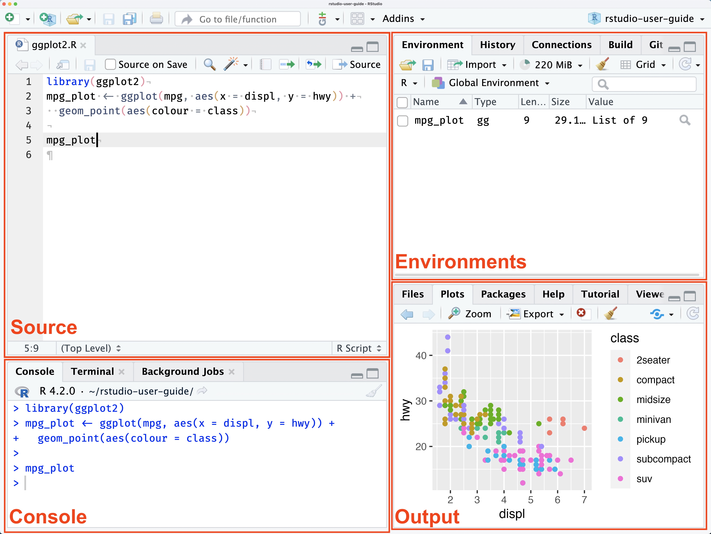

```{r setup, include=FALSE}
knitr::opts_chunk$set(echo = TRUE)
```

# Learning Outcomes

In this Session of our R Workshop, we will cover the following introductory aspects of R Studio & Programming:

-   R vs. RStudio
-   RStudio Environment
-   Notebooks & Scripts
-   Variables & Data Types
-   Anatomy of Base R Functions
-   Data Structures
-   Operators

By the end of this Session, you will understand:

1.  The difference between R and RStudio
2.  The default layout of the RStudio Environment
3.  What a variable is and how to declare one
4.  Basic anatomy of a function in R
5.  Basic data types available in R
6.  Basic data structures and how to access the data in them
7.  What an operator is and some available in R

# R vs. RStudio: What's the Difference?

-   R is an open-source programming language
    -   used widely for data science and statistical analysis.
-   Open-source means free to use and:
    -   Access to many libraries and packages
    -   Some tested more diligently than others
-   RStudio is an programming environment
    -   makes it easier to write and test scripts developed in R.

# RStudio Environment

There are four main window panes in RStudio: the Source, the Console, the Environments and the Output Window. [](https://docs.posit.co/ide/user/ide/guide/ui/ui-panes.html)

## Source Pane

-   Shows open scripts, Notebooks and other files you are editing.
-   The area where you can view data

We'll talk about scripts and Notebooks soon.

## Console Pane

-   Features 3 tabs by default:
    -   Console Tab
        -   Enter commands that run immediately
        -   Good for testing
    -   Terminal
        -   let's you interact with your computer terminal
    -   Background Jobs
        -   provides information on "background" scripts which run in a separate dedicated R session.

## Environments Pane

The Environments pane has four tabs available by default:

-   Environment
    -   Provides info about variables defined in during your session
-   History
    -   Shows all the commands you have run during your session
    -   Can be saved across sessions
    -   Can be copied to console or a script
-   Connections
    -   beyond the scope of this workshop
    -   check out [this info](https://docs.posit.co/ide/user/ide/guide/ui/ui-panes.html#connections) for more information
-   Tutorial
    -   provides access to interactive tutorials.
    -   Check them out!

## Output

The output pane has a variety of tabs that provide access to different types of output. This includes files, plots, packages, help and a couple of other specialized output types. Tabs in this pane include:

-   Files
    -   shows your file directory
    -   projects created in a directory will set the "working directory" to the directory it is stored in
    -   without a project, you may need to set a "working directory"
    -   setting a "working directory" lets you use relative path names
-   Plots
    -   this is where plots will show up when you generate them

```{r Plot_tab_example}
# Lets create a little plot
# create some data

# generate plot


# function name
# function parameters
# return values

```

-   Packages
    -   Interface to install packages
    -   Installed packages
        -   Any package listed
    -   Loaded packages
        -   Any package with a checkmark to the left of its name
-   Help
    -   Your best friend!!
    -   You can see the details about functions you want to use
    -   use search bar in pane or type "?barplot" in console
-   Viewer
    -   Shows output for rendered notebooks
-   Presentation
    -   Shows output when you generate slides using Quarto

------------------------------------------------------------------------

## Quiz \# 1

### Where do you look for...?

1.  Where would you look for the value of a variable you set?

-   Source Pane
-   Terminal Tab in the Console Pane
-   Environment tab in the Environment Pane
-   Viewer tab in the Output Pane

2.  Where would you find the output of a plot command?

-   Plots tab of the Output pane
-   Source pane
-   History tab of the Environment pane
-   In a notebook, below the code block that generates the plot

3.  What pane is your script or notebook file open in?

-   Source pane
-   Console pane
-   Environment pane
-   Output pane

## Quiz \# 1 ANSWERS

1.  Environment tab in the Environment Pane
2.  Plots tab of the Output pane
3.  Source Pane

------------------------------------------------------------------------

# Notebooks & Scripts

Through RStudio, you can use and render R code in a variety of ways including:

-   Scripts
    -   These are the way most people start out.
    -   A script has a file type of .R
    -   You can easily run the entire script using the Run command
    -   Only comments and code.
-   Notebooks
    -   Great way to have text and code together
    -   Can contain text, code chunks, equations, tables
    -   Good when small bits of code are being run for a discrete task.

Even though you will probably use scripts when you start out coding, for this workshop we are going to work in a notebook to take advantage of the ability to have readable text along side runnable code.

# Variables in R

Variables are named containers used to store information. What can we name them? Almost anything we want, according to the following rules:

-   name has to start with a letter
-   can contain any combination of letters, numbers and can include periods "."
-   can't start with an underscore, "\_"
-   are case sensitive
-   can't be any of the reserved words in R

## What R reserved words?

All programming languages have reserved words. These are words that have a specific meaning to the language itself. Some examples in R include:

-   TRUE
-   FALSE
-   NULL
-   if

You can find a list of reserved words [here](https://rdrr.io/r/base/Reserved.html).

## Will it Variable?

For a variable to be useful, you must give it a value. To set a variable to a value, you use the assignment operator. You've seen this in math, for instance, $a+b=5$. In R, to assign a value to a variable we use "\<-". We'll talk more about operators later, but now you know the assignment operator!

The code box below shows some example variables. Use CMD/CTRL + RETURN/ENTER to run a line of code.

```{r Variables}


```

## I Digress ...

In most programming languages, you use "=" as the assignment operator, like you see with `i.am.happy` above. While R lets you use "=", the convention is to use "\<-". This is a holdover from the language from which R is derived, S. Programmers are funny, funny people.

------------------------------------------------------------------------

## QUIZ \# 2

Using the rules listed above which of the following passwords will work?

-   My_favoritePASSWORDofAlL.tymes
-   \_favoritePW
-   PW6
-   PW6_myfav
-   6PW
-   If
-   if

```{r Quiz-2-Variables}
# Not sure which will run? 
# Use the assignment operator to assign the value 5 to a variable using the names above. Feel free to test some you define yourself!


```

## Quiz \# 2 Answers

The acceptable passwords are:

-   My_favoritePASSWORDofAlL.tymes
-   PW6
-   PW6_myfav
-   If

------------------------------------------------------------------------

# Data Types

Data Types

-   are categories of data
-   dictate
    -   how much space a variable of that type will take
    -   determine how they are handled as input and output
    -   how you can use the variable
-   sometimes R cares about what data type you use
-   sometimes R doesn't care (e.g., is really flexible)

We'll talk about 4 main data types:

-   Numeric
-   Text
-   Date/Time
-   Logical or Boolean

## Numeric

Numeric values can be described as integers, decimals (floating point numbers) and complex. We will focus on integers and decimals, but be aware that R can handle complex values too.

Some languages aggressively distinguish between integers (whole numbers) and floating point (decimal) values. R does not. In R, when you store a number it is loaded as a `double`. This is just another word for decimal or floating point.

In most situations, you don't have to worry about whether a number is an integer or a floating point value. However, it does recognize integers and doubles (floating point). It also has functions that check or convert a number to integers and floats. Read more about numbers in R [here](https://www.burns-stat.com/documents/tutorials/impatient-r/more-r-key-objects/more-r-numbers/).

------------------------------------------------------------------------

Let's look at some examples.

```{r Integers}


# Uncomment the line below.
# Look for a red x to the left of the line number
# Try to run the line of code.

# wolfStudentsInUS <- 13,433

# Remember to re-comment the line because the error may keep the notebook from rendering.
```

> REMEMBER: computers don't need commas in numbers. That's just to make them easier to read for us humans.

```{r Doubles-no-not-tennis}

# Now we'll define some floating point variables

# stillNoCommas <- 4,325.98

# will print as an integer if the value to the right of the decimal = 0

```

> Use the `typeof()` function to check what data type R thinks a variable is.

## Text

We've looked at the scary, scary numbers. Let's look at good old familiar text. Run the code in the block below. What data type does R see string data as? Hint: run the last line!!

```{r}
# Some text examples


# What if you have quoted text in your string?

# Is this ok?

```

Compare the output of the `print()` statements for `wolfQuote2` and `wolfQuote3`. Based on the output, should you use double quotes first or single quotes?

> Note, the "\\" you see when you print `wolfQuote3` is called an escape character. You use it to differentiate between a character that should be used as a character as opposed to indicating the beginning or end of a string. You might also use it to indicate a non-printing character. An example would be "\\n" which is a line feed. In this case, we want to have a string that includes quoted text, but we use quotes to tell R something is a string. The example above shows that R uses double quotes to identify the beginning and end of a string and if we need to include quoted text, we should use single quotes.

## Dates & Times

Dates are their own special kind of special. The Date/Time data type is useful for:

-   Outputting dates so they look pretty and conform to the style you want them to (e.g., 8/26/2025, August 26, 2025; 25/08/2025).
-   Being able to do date math: how many weeks, days, months, years between two dates, etc.

We can define a date as a string. The computer doesn't care:

```{r Text-Dates}

```

Why would we want to use a date data type? See above or try the code below. Uncomment the line that states with `letsAdd4Days` and try to run it.

```{r Text-Dates-Are-Bad-At-Math}
# To explore when data strings break, uncomment the next line and try to run it. We are just trying to find out what the date is 4 days from our date string:

# letsAdd4Days <- aDateButItsReallyAString + 4

# !! Recomment it when you are done. Otherwise you notebook won't render.
```

Using text dates has it's limitations. What if you didn't want to print it out as "07/15/2025", but wanted to show "July 15, 2025"?

That's where the date data type comes in.

```{r Date-Dates}
# Let's try some dates


```

Why does the output of `wolf2.bday` and `wolf3.bday` look different from the text we provide the function? This is because both the `as.Date()` and `as.POSIXct()` functions store the date in a base formate ("YYYY-MM-DD"). You can display the date in many different formats.

```{r date-format}


```

What if we want to find the date 20 days after a wolf's birthday?

```{r Date-Dates-Math}

# wolf1.bday.plus20 <- wolf1.bday.text + 20


```

Yes!

## Logical

A Boolean value is one that can take one of two values: 0 or 1. In R, these types of values are represented using the "logical" data type. The logical data type takes the value TRUE (1) or FALSE (0). It is good for setting flags and creating indices to subset data.


```{r Boolean-Examples}
# Example of boolean variables


```

When we get to the section on operators, you will begin to see the extent to which we use logical values in programming. It make sense when you remember that computers only understand voltage off/voltage on which gets encoded as 0/1. So, of course we would use logical values a lot. It is the most basic thing computers can manipulate.

------------------------------------------------------------------------

## Quiz \# 3

Pick a personal or research interest and generate variables using appropriate data types to represent your interest.

```{r Quiz_3-Variables}


# Create a variable and set it to some text.

# Create a variable and set it to a numeric value


# Create a text variable and set it to a text date.


# Create a date variable and convert the text date to a date using `as.Date()`


# Print your date variable to the screen


```

------------------------------------------------------------------------

# Data Structures

So, we've looked at the basic data types in R. In this section, we'll explore ways values can be stored in R. When we discuss how data is stored in a programming language we refer to data structures.

We will explore three widely used data structures:

-   arrays/vectors
-   matrices
-   dataframes

Basic distinguishing factors between data structions include:

-   do they store only one data type or multiple data types?
-   do they have one dimension, two dimensions or \> 2 dimensions?

There are two aspects of using data structures:

-   how to create them; and,
-   how to access the data in them.

We'll cover both.

## Vectors (1-D Arrays)

Vectors store data in one dimension and allow only one data type to be stored.

## I Digress ...

In point of fact, R is a vectorized language. What does that mean? It means scalars (single values) in R are really 1-element vectors. Will this have a big impact on learning R? No, probably not. But you can whip this fact out at parties and amaze your friends.

### How to Create Vectors

Creating vectors is shown in the code below. We'll make one for integers, floating point values, text and Boolean. No dates.

```{r Define-Vectors}
# Let's clean up the variables to make it easier to see what's going on
rm(list=ls())

# EXAMPLES OF HOW TO CREATE VECTORS
# (Single Data Type)

# Integer. Ok, fine, double.
# What if we want to store the number of NCSU wolves prowling
# around 5 different locations on campus?


# Float. Ok, fine, double
# We want to store the weights of 6 wolves prowling around campus


# Text.
# We want to reference the five locations at which we counted wolves


# Boolean/Logical
# We want to know if the wolves we weighed are female


# Vectors only store one data type...really!
# We decide inappropriately to store a bunch a information about
# our favorite Wolf in a vector
# We store: name, weight, isFemale, location and age


```

While R will let you pass different types of data to an array, it will convert all values to a single type. How it converts these values depends on what types of values you put in it. Feel free to try combinations of data types to see what happens. But don't do this in practice.

### Accessing Elements in a Vector

Elements in a vector are accessed using an index, or range of indices between two square brackets. Let's try it out.

```{r Access-Elements-In-Vectors}
# Make sure you ran the code above to define the vectors before accessing them. 
# Click on the green run button in the code chunk above.

# VECTORS

# Single index
# grab the 3rd count from numWolves (# of wolves at Hunt Library)


# Range of values
# Let's grab the 2-4 wts of our wolves

# list of indices

# Out of range
# What happens if we do the following?

# can't access what you haven't defined

```

## Matrices (or n-D Arrays)

Matrices:

-   can have 2 or more dimensions

-   hold only one data type

They are useful in computational work. There are a couple of ways to declare a matrix in R.

If you only need a 2-dimensional matrix (rows and columns only), you can use `matrix()`. You define the number of rows and columns. Let's see an example below:

```{r Two-Dimension-Matrices}
# Create a 2-D matrix
# We need to store counts of Wolves in 5 locations over the course of 7 days
# a 2-D matrix would work well: one data type and we can have the rows represent
# locations and the columns = days

# Define Days of Week so we can use them again

# for ease of use, we can set rownames and colnames to be descriptive


```

To create a matrix that has more than 2 dimensions, you use the `array()` function.

```{r Multi-dim-matrices}
# Create a 3-D matrix
# We now want to store counts of wolves at 5 locations, 7 days a week, for 4
# weeks. 


```

### Accessing Elements in a Matrix

Data in a matrix is accessed using indices just like arrays. An index is provided for each dimension.

```{r access-matrix}
# Make sure you run the code above to create the matrices wolfCounts and 
# locWolfCounts

# Accessing an element in a 2-D matrix requires two indices: one for row and
# one for column

# Extract the number of wolves in Talley on Wednesday


# If you provided row and column names, you can use those


# What if we want to see the counts for Talley on all days?


# using row name


# How about if we want to see the counts for all locations on Wednesday?


# To access data in a multi-dimensional array you just need more indices
# We can access the wolfCounts at Burlington Lab on Tuesday of the 3rd week


# row, column, dimension

# We can also use row, column and dimension names


# We can set the value of data using indices too


```

## Dataframes (Tabular Data)

Vectors and matrices are great when we have a single datatype we need to store. What if we need to store different datatypes for each sample?

Dataframes:

-   are 2-dimensional tabular structures for storing data (rows and columns)
-   allow multiple datatypes, but each column must be the same datatype.
-   are similar to excel tables.

```{r Data-frames}
# We want to store data about some of our favorite Wolves who hang out at
# NC State.


# Extract data from data frames
# We use indices like we do with vectors and matrices to extract or set data

# Extract Column data
# Extract the names of all the wolves


# Extract data in first two columns


# Extract Data from non-contiguous columns


# Extract row data
# Extract data for wolf in row 1


# Extract data for wolves in rows 1-3


# Extract data for wolves in rows 2 and 5


# Extract data for female wolves only


```

------------------------------------------------------------------------

## Quiz \# 4

```{r Quiz-4-Data-Structures}
# For the scenarios below identify the data structure you would use
# Create the data structure and populate it with data
# It doesn't have to be big?

# 1.  You want to store data about cars you are test driving this weekend.
#     You want to store the make, model, year, price, mpg city and 
#     mpg highway.

#     What type of data structure should you use and why?
#     Data frame because you want to store different data types

# Define the dataframe below and provide some data for it


# 2.  You want to store 
#     The number of Fiction and Nonfiction Books on 4 shelves of your bookcase

#     What type of data structure should you use and why?
#     2-D matrix: Single data type, 2 dimensions (use matrix() function)
#     Rows could be Fiction/Nonfiction, columns Shelf # or vice versa


# 3.  You want to store
#     The weight in grams of 6 beetles

#     What type of data structure should you use and why?
#     Array/vector: one dimension, one data type


# 4.  You want to store
#     Temperature for 2 days, in 3 towns, at 2 locations/town

#     What type of data structure should you use and why?
#     matrix: one datatype, > 2 Dimensions (use array())


```

------------------------------------------------------------------------

# Operators

Operators are used to perform, not unsurprisingly, operations. They provide a way to compare values and variables. Operators may sound exotic, but you've encountered them in any basic math class you've ever taken. We've covered the assignment operator...quick what is the assignment operator?

We'll cover the following kinds of operators:

-   Arithmetic,

-   Relational, and

-   Logical.

## Arithmetic

I'm sure you can already guess what these are:

|  Operator  | *U*nary / *B*inary |    Operation     |   Example   |
|:----------:|:------------------:|:----------------:|:-----------:|
|     \-     |         U          |     negation     |     -5      |
|     \+     |         B          |     addition     | amt1 + amt2 |
|     \-     |         B          |   subtraction    | amt1 - amt2 |
|     \*     |         B          |  multiplication  |   2\*amt1   |
|     /      |         B          |     division     |   amt1/2    |
| \^ or \*\* |         B          |      power       |    2\^3     |
|     %%     |         B          |     modulus      |   10 %% 3   |
|    %/%     |         B          | integer division |  10 %/% 3   |

Operators can be referred to as **unary** or **binary**. From math class, you may recall that operators act upon **operands**. Unary means that an operator takes a single operand while binary indicates it takes two. The `-` operator is an example of an operator that can work as an unary or binary operator. It is not essential you know this, but if you hear it in the future you'll know what it means.

```{r Unary-Binary-Operators}
# Let's clear out our variables
rm(list=ls())

# Example of unary -


# Example of binary -


```

Most of the arithmetic operators should be familiar. Examples are provided below:

```{r Arithmetic-Operators-1}
# Use operators with values


# Separate Output
print('* * * * * * * * * * *')

# Use familiar operators with variables
# We'll be creative and use new values


# Apply operators to variables
# Make sure adultWolves and babyWolves is defined in your workspace!


```

However, some operators may be new. These include the modulus operator, `%%`, and the special operator for integer division, `%/%`. These two operators provide special functionality. The modulus operator returns the remainder of integer division. The operator to perform integer division returns the quotient of the division.

```{r Arithmetic-Operators-2}
# We want to know how many treats we have for each wolf

# divides evenly

# doesn't divide evenly


# Integer Division & Modulus numWolvesTalley


# So, wolves at valley get 5 treats and there are no leftovers

# Separate Output
print("* * * * * * * * * *")

# Integer Division & Modulus using numWolvesHunt


# Wolves at Hunt, on the other hand get three treats and there is 1 left over.
# Good luck with that.

```

## Relational

Relational operators are all binary and are used to compare two values. The result of using relational operators is a logical (Boolean) value: `TRUE` or `FALSE`.

| Operator |        Operation         |    Example    |
|:--------:|:------------------------:|:-------------:|
|    \<    |        less than         | `mynum` \< 3  |
|   \<=    |  less than or equal to   |               |
|    \>    |       greater than       | `mynum` \> 3  |
|   \>=    | greater than or equal to | `mynum` \>= 3 |
|    ==    |         equality         |   "a"=="b"    |
|    !=    |        inequality        |   "a"!="b"    |

```{r Relational-Operators}
# Let's clear out our variables
rm(list=ls())

# Define the weights of some wolves (in pounds) around campus


# Let's compare Snoopy's weight to the other wolves


# Let's look at `==` more closely
# comparing integers: good!

# comparing floating point: less good!


# DON'T DO THIS

```

Comparing equality in floating point numbers is ill-advised. This is particularly true when the variables you are comparing are the result of calculation. In the example above, if a caluclation resulted in 70..000000001 and we wanted to compare this calculation to the weight of Artemis, in terms of pounds the fractional part is not informative. In practice, we would likely consider these two weights equal, but your computer would not find it so. With floating point numbers, it is standard practice to use a tolerance instead. This allows you to control the precision with which you check equality. See the example below:

```{r Tolerance-Example}
a <-  0.4 + 0.5
b <-  0.9
epsilon <- 1e-9 # a very small number

(a-b) < epsilon # if the difference is less, then you assume equality.
print(a-b)
```

## Logical

Logical operators are used to compare logical values and variables or relational expressions that evaluate to logical values. There are two main types of logical operators: the AND operator and the OR operator.

| Operator |    Operation     |                    Example                    |
|:--------------:|:--------------:|:---------------------------------------:|
|    &     | Element-wise AND | c(TRUE, TRUE, FALSE) & c(FALSE, TRUE, FALSE)  |
|    &&    |   Logical AND    |                isCute & isBig                 |
|    \|    | Element-wise OR  | c(TRUE, TRUE, FALSE) \| c(FALSE, TRUE, FALSE) |
|   \|\|   |    Logical OR    |                    isCute                     |
|    !     |   Logical NOT    |                    !isCute                    |

```{r Logical-Operators}
# Use variables from last section

# Define some variables to compare


# Define some Boolean variables and set them


# Check if numWolves is less than numDogs AND numCats is less than numDogs


# Check if numDogs is less than or equal to 25 OR numCats is less than or equal to 25


# Check if numDogs is less than 150 OR numCats is less than 150


# See isParty is TRUE AND if numDogs is greater than 0 AND haveHotdogs is FALSE
# This could be a problem


# See if (numDogs is greater than zero AND haveHotdogs is TRUE) OR (numCats is greater than 0 AND haveCheetos is TRUE)


# How could you fix the expression above to make sure that you have food available for both cats and dogs who come to your party?


```

------------------------------------------------------------------------

## Quiz \# 5

```{r Quiz-5-Operators}

# You are having a party. You've decided to put your newly gained computational skills
# to work. Use code to solve the following problems.

# PROBLEM 1
# You need to see if you have more buns than hotdogs. Create two variables, numBuns and numHotdogs and set them to any values you want. Create a variable "haveEnoughBuns" and write an expression that sets `haveEnoughBuns` to TRUE if you have enough. Try different values for `numBuns` and `numHotdogs`, if you want.

# Declare `numBuns` and `numHotDogs`


# Check if you have enough buns.


# PROBLEM 2
# Next, we need to make sure we have potato chips for our guests 

# Declare the following variables:
#
# `perfectChipsPortion`: set it to the number of grams a perfect portion of potato
# chips would be
# `numGuests`: set it to the number of guests you've invited


# Also declare
#
# `numBagsChips`: set to the number of bag of chips you picked up
# `gramsPerBag`: set this to the number of grams of chips per bag


# Calculate the number of grams of chips you need for all your guests
# name the variable `chipsNeededInGrams`


# Calculate how many of grams of chips you have
# name this variable `totalChipsInGrams`


# Create a Boolean variable and name it `haveEnoughChips`
# compare the number of chips you need to the number you have (in grams)
# You want `haveEnoughChips` to be TRUE if you have enough


# How many grams of chips do I need?


# How many grams of chips do I have?


# Do I have enough chips? Drum roll please...


# PROBLEM 3
# We now need to make sure that we have enough food.

# Use a logical operator to check whether you have enough buns for your hotdogs and
# enough chips for your guests. Declare a variable to store the result.


# PROBLEM 4
# In this problem we are going to write code that let's use check whether a number is
# even.

# Declare a variable and set it to the number you want to check


# Use modulus to find the remainder of dividing your number by 2. 
# Then check if this remainder is zero. 
# This can be done it two steps or one

# Two Steps


# One step


```

------------------------------------------------------------------------

In our next workshop, **Control Flow and Functions**, we'll learn about and practice:

-   Conditional and Flow Control Statements
    -   if
    -   for
    -   while
-   Functions, including
    -   built-in
    -   library
    -   user-defined
-   Getting help
-   File Input and Output

# Before You Go

## Take our Survey

We appreciate your input. Let us know how this Workshop went for you! We take your input seriously and appreciate the time you take to give it. Please fill out [our survey](https://go.ncsu.edu/dss-workshop-eval).

## Need Additional Help?

We are available to help you with whatever question you have about this Workshop or programming in general. If you run into snags or questions (we all do), as you start to create programs for yourself, reach out to [us](https://go.ncsu.edu/getdatahelp). Send an email, make an appointment, or reserve a workstation! We are here to assist you to be successful in your data science journey.

------------------------------------------------------------------------
