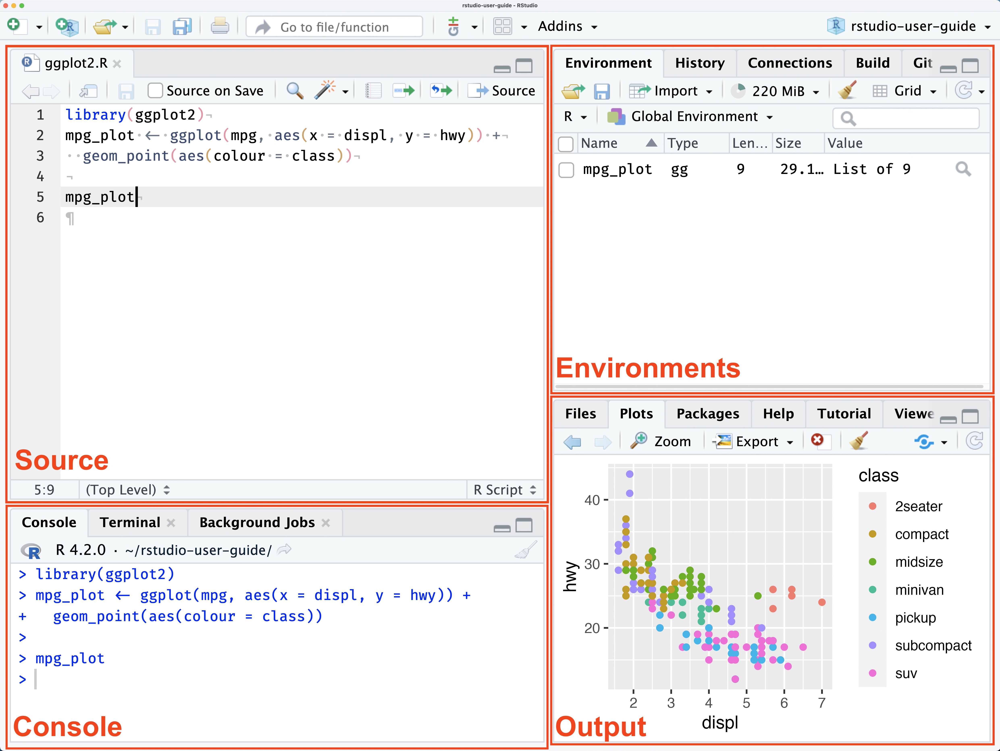

# Learning Outcomes

In this Session of our R Workshop, we will cover the following introductory aspects of R Studio & Programming:

- R vs. RStudio
- RStudio Environment
- Notebooks & Scripts
- Variables & Data Types
- Anatomy of Base R Functions
- Data Structures
- Operators

By the end of this Session, you will understand:

1.  The difference between R and RStudio
2.  The default layout of the RStudio Environment
3.  Basic anatomy of a function in R
4.  What a variable is and how to declare one
5.  Basic data types available in R
6.  Basic data structures and how to access the data in them
7.  What an operator is and some available in R

# R vs. RStudio: What's the Difference?

- R is an open-source programming language
  - used widely for data science and statistical analysis.
- Open-source means free to use
  - With access to many libraries and packages
  - Some tested more diligently than others
- RStudio is a programming environment
  - makes it easier to write and test scripts developed in R.

------------------------------------------------------------------------

# RStudio Environment

There are four main window panes in RStudio: the Source, the Console, the Environments and the Output Window.

[{width="6in"}](https://docs.posit.co/ide/user/ide/guide/ui/ui-panes.html)

## Source Pane

- Shows open scripts, Notebooks and other files you are editing.
- The area where you can view data

We'll talk about scripts and Notebooks soon.

## Console Pane

- Features 3 tabs by default:
  - Console Tab
    - Enter commands that run immediately
    - Good for testing
  - Terminal
    - let's you interact with your computer terminal
  - Background Jobs
    - provides information on "background" scripts which run in a separate dedicated R session.

## Environments Pane

The Environments pane has four tabs available by default:

- Environment
  - Provides info about variables defined in during your session
- History
  - Shows all the commands you have run during your session
  - Can be saved across sessions
  - Can be copied to console or a script
- Connections
  - beyond the scope of this workshop
  - check out [this info](https://docs.posit.co/ide/user/ide/guide/ui/ui-panes.html#connections){target="_blank"} for more information
- Tutorial
  - provides access to interactive tutorials.
  - Check them out!

## Output

The output pane has a variety of tabs that provide access to different types of output. This includes files, plots, packages, help and a couple of other specialized output types. Tabs in this pane include:

- Files
  - shows your file directory
  - projects created in a directory will set the "working directory" to the directory the project file is stored in
    - without a project, you may need to set a "working directory"
    - setting a "working directory" lets you use relative path names
- Plots
  - this is where plots will show up when you generate them

```{r Plot_tab_example}
# Lets create a little plot
# create some data
data <- data.frame(a = c(72,41,54,36), b=c('East','West','North','South'))

# generate plot
barplot(data$a, 
        names.arg = data$b, 
        col="blue", 
        ylab="# of Regional Managers")

# function name
# function parameters
# return values

```

- Packages
  - Interface to install packages
  - Installed packages
    - Any package listed
  - Loaded packages
    - Any package with a check mark to the left of its name
- Help
  - Your best friend!!
  - You can see the details about functions you want to use
  - use search bar in pane or type "?barplot" in console
- Viewer
  - Shows output for rendered notebooks
- Presentation
  - Shows output when you generate slides using Quarto

The Pane layout is very customizable. You can access it as follows:

### Mac Version

From the menu bar, select **Edit**-\>**Preferences**

From the sidebar in the Options window, choose **Pane Layout**

### Windows Version

From the menu choose **Tools**-\>**Global** Options

From the sidebar in the Options window, choose **Pane Layout**

------------------------------------------------------------------------

## Quiz \# 1

### Where do you look for...?

1.  Where would you look for the value of a variable you set?

- Source Pane
- Terminal Tab in the Console Pane
- Environment tab in the Environment Pane
- Viewer tab in the Output Pane

2.  Where would you find the output of a plot command?

- Plots tab of the Output pane
- Source pane
- History tab of the Environment pane
- In a notebook, below the code block that generates the plot

3.  What pane is your script or notebook file open in?

- Source pane
- Console pane
- Environment pane
- Output pane

------------------------------------------------------------------------

# Notebooks & Scripts

Through RStudio, you can use and render R code in a variety of ways including:

- [Scripts](Example_script.R){target="_blank"}
  - These are the way most people start out.
  - A script has a file type of .R
  - You can easily run the entire script using the Run command
  - Only comments and code.
- Notebooks
  - Great way to have text and code together
  - Can contain text, code chunks, equations, tables
  - Good when small bits of code are being run for a discrete task.
  - Two options: R Notebooks (.Rmd) and Quarto (.qmd)
    - Quarto is language-agnostic where as R Notebooks are tied to RStudio
    - I choose Quarto for the flexibility

For this workshop, we will work in a Quarto notebook to take advantage of the ability to have readable text along side runnable code.

------------------------------------------------------------------------

# Variables in R

Variables are named containers used to store information. What can we name them? Almost anything we want, according to the following rules:

- name has to start with a letter
- can contain any combination of letters, numbers and can include periods "."
- can't start with an underscore, "\_"
- are case sensitive
- can't be any of the reserved words in R

## What R reserved words?

All programming languages have reserved words. These are words that have a specific meaning to the language itself. Some examples in R include:

- TRUE
- FALSE
- NULL
- if

You can see the reserved words in R by typing `?reserved` at the console prompt. You can also find a list of reserved words [here](https://rdrr.io/r/base/Reserved.html){target="_blank"}.

## Will it Variable?

For a variable to be useful, you must give it a value. To set a variable to a value, you use the assignment operator. In R, to assign a value to a variable we use "\<-". We'll talk more about operators later, but now you know the assignment operator!

The code box below shows some example variables. Use the arrow to the left of the code box to run the code.

```{r}
#| label: set-variables

# Set some variables:


# See the variable value
# print(wolf.name)
# print(wolf.age)
```

## I Digress ...

In most programming languages, you use "=" as the assignment operator, like you've seen above the R convention is to use `<-`. While R lets you use "=", the convention is to use "\<-". This is a holdover from the language from which R is derived, S. R programmers have feelings about this. Programmers are funny, funny people. Welcome to the club!

------------------------------------------------------------------------

## QUIZ \# 2

Using the rules listed above which of the following passwords will work?

- My_favoritePASSWORDofAlL.tymes
- \_favoritePW
- PW6
- PW6_myfav
- 6PW
- If
- if

```{r}
#| label: var-name-workspace

# Not sure which will run?
# Use the assignment operator to assign the value 5 to a variable using the
# names above. Feel free to test some you define yourself!

My_favoritePASSWORDofAlL.tymes <- 5

```

------------------------------------------------------------------------

# Helpful Keyboard Shortcuts

| Description                | Windows & Linux | Mac           |
|----------------------------|-----------------|---------------|
| insert assignment operator | Alt+-           | Option+-      |
| insert code chunk          | Ctrl+Alt+I      | Cmd+Option+I  |
| Run current line & advance | Ctrl+Enter      | Cmd+Return    |
| Run current line           | Alt+Enter       | Option+Return |
| Comment/uncomment          | Ctrl+Shift+C    | Cmd+Shift+C   |

: See [Posit's list of keybinds](https://support.posit.co/hc/en-us/articles/200711853-Keyboard-Shortcuts-in-the-RStudio-IDE).

------------------------------------------------------------------------

# Data Types

Data Types

- are categories of data
- dictate
  - how much space a variable of that type will take
  - determine how they are handled as input and output
  - how you can use the variable
- sometimes R cares about what data type you use
- sometimes R doesn't care (e.g., it is really flexible)

We'll talk about 4 main data types today:

- Numeric
- Text
- Date/Time
- Logical or Boolean

## Numeric

Numeric values are exactly what they sound like: numbers. R can work with integer, double (floating point or decimal) and complex numbers. We'll focus on integer and double since they are the most common.

Some languages aggressively distinguish between integers (whole numbers) and double (numbers with a decimal point) values. R does not. In R, when you store a number it is loaded as a `double` regardless of whether it has a decimal point or not.

Most of the time you don't have to worry about whether a number is an integer or a double value. However, R has functions that check or convert a number to integers and floats. Read more about numbers in R [here](https://www.burns-stat.com/documents/tutorials/impatient-r/more-r-key-objects/more-r-numbers/).

Let's look at some examples.

```{r}
#| label: numeric-type

# Create some variables and set them to numeric values


# print(numWolves)
# print(pctWolves)

# print(typeof(numWolves))
# print(typeof(pctWolves))

# Add a decimal place to numWolves


# print(numWolves)
# print(typeof(numWolves))
# print(as.double(numWolves))

```

## Text

We've looked at the scary, scary numbers. Let's look at good old familiar text. Run the code in the block below. What data type does R see string data as? Hint: run the last line!!

```{r}
#| label: text-type

# Some text examples


# print(wolf.name)
# print(wolf.initial)
# print(wolf.FavoriteArtist)
# print(typeof(wolf.name))

```

### Storing Sentences

When dealing with longer sentences, it is important to keep track of double- and single-quotes.

```{r}
#| label: text-quotes

# You can use single quotes to surround a string
wolfQuote1 <- 'He had learned well the law of club and fang.'
print(wolfQuote1)

# You can nest double and single quotes.
wolfQuote2 <- "'You poor devil,' said John Thornton, and Buck licked his hand."
print(wolfQuote2)

# Notice what happens when you switch the single and double quotes
wolfQuote3 <- '"You poor devil," said John Thornton, and Buck licked his hand.'
print(wolfQuote3)
```

## Dates & Times

Dates are their own special kind of special. The Date/Time data type is useful for:

- Outputting dates so they look pretty and conform to the style you want them to (e.g., 8/26/2025, August 26, 2025; 25/08/2025).
- Doing date math: how many weeks, days, months, years between two dates, etc.

We can define a date as a string. The computer doesn't care. While we can print the data, we can perform any date math on it. Uncomment the last line in

```{r}
#| label: date-string 

# define a variable and set it to a text date

# print(dateStr)
# addDays <- dateStr + 4
```

To be able to manipulate dates you need to store or convert them to a date. In Base R, i.e., without loading a library, there are 3 main functions that convert a string to a date: `as.Date()`, `as.POSIXct()`, and `as.POSIXlt()`. `as.Date()` stores only date info, while the two `as.POSIX` functions store time info, including timezone. The difference between the two `as.POSIX` functions lies in how the data is stored.

```{r}
# Let's try some dates

# create text date


# convert using as.Date()

# print(bday.1)

# convert using as.POSIXct()

# print(bday.2)
```

For a list of format codes like `%m` and what they represent, type `?strptime()` in the console and look in the **Details** section.

You may have noticed that when we print out the date, even though we provided the format of the date, it printed out in a YYYY-MM-DD format. This reflects how the date is stored. However we can use the `format()` command with the date codes found in the `strptime()` help to print the date out in many different formats.

```{r}
#| label: format-dates

# Define a date using long names


# print(bday.long)

```

We can also now perform math on our dates:

```{r}
#| label: date-math

# Define an anniversary date using bday.1


# print(anniversary)

```

------------------------------------------------------------------------

## QUIZ \# 3

How can we print `wolf1.anniversary` in the same format as `wolf1.bday.long`?

```{r}
#| label: Quiz-3

# Uncomment the lines below to use as a template

# wolf1.anniversay.long <- 
# print()

```

## Logical

A Boolean value is one that can take one of two values: 0 or 1. In R, these types of values are represented using the "logical" data type. The logical data type takes the value TRUE (1) or FALSE (0). It is good for setting flags and creating indices to subset data.

{width="6in"}

```{r}
#| label: logical-examples

# Example of boolean variables based on picture. Define a values for isAlive and isWolf.1

# print(isWolf.1)
# print(isAlive)


# What do you think? Uncomment the two lines below and set them to the value you think they should be and print them to screen.

#isMajestic = 
#isWolf.2 = 

# print(isWolf.2)
# print(isMajestic)

```

Logical values are used ubiquitously in programming, particularly for program control. When we get to the material on operators, you will begin to see how they are used.

------------------------------------------------------------------------

# Data Structures

We've looked at the basic data types in R and how to store values in variables. In this section, we'll explore 3 widely-used data structures. Data structures are programming structures that allow storage of multiple values.

The structures we will explore are:

- arrays/vectors
- matrices
- data frames

Basic distinguishing factors between data structions include:

- how many data types to they allow? one? more?
- how many dimensions do they allow? 1? 2? more?

There are two aspects of using data structures:

- how to create them; and,
- how to access the data in them.

We'll cover both.

## Vectors (1-D Arrays)

Vectors store data in one dimension. The allow only one data type.

## I Digress ...

In point of fact, R is a vectorized language. What does that mean? It means scalars (single values) in R are really 1-element vectors. Will this have a big impact on learning R? No, probably not. But you can whip this fact out at parties and amaze your friends.

### How to Create Vectors

```{r}
#| label: vector-examples

# EXAMPLES OF HOW TO CREATE VECTORS
# (Single Data Type)

# Numeric
# Since R sees integers and decimal data as double, vectors can contain both

# print(num.vec)
# print(typeof(num.vec))

# Examples using other data types
# txt.vec <- 
# log.vec <- 


```

Vectors only store one data type...really, really! But, what happens if you mix data types?

```{r}
#| label: mixed-data-type-vec

# Let's store some info about a pet cat named Fluffy: name, weight, isFemale, birthdate and age
mixed.vec <- c("Fluffy", 12.0, TRUE, as.Date("9/1/2024",format="%m/%d/%Y"), 2) # so far so good

print(mixed.vec) # oops...
```

While R will let you pass different types of data to an array, it will convert all values to a single type. How it converts these values depends on what types of values you put in it. To see that this may not always be text, remove "Fluffy" from the vector and print it out again.

## Matrices (or n-D Arrays)

Matrices:

- can have 2 or more dimensions
- hold only one data type

They are useful in computational work. There are a couple of ways to declare a matrix in R.

If you only need a 2-dimensional matrix (rows and columns only), you can use `matrix()`.

```{r}
#| label: matrix-2D

# generate 35 random values between 0 and 50
data <- sample(0:50, size = 35, replace = TRUE) # generates a vector
print(data)

# make a 2-D matrix out of data


# print(matrix.2D)

```

To create a matrix that has more than 2 dimensions, you must use the `array()` function.

```{r}
#| label: 3D-matrix

# generate 75 random values between 0 and 50
data <- sample(0:50, size = 75, replace = TRUE)

# make a 3-D matrix from data


# print(matrix.3D)

```

## Dataframes (Tabular Data)

Vectors and matrices are great when we have a single datatype we need to store. What if we need to store different datatypes for each sample?

Data Frames:

- are 2-dimensional tabular structures
- allow multiple datatypes, but each column must be the same datatype.
- are similar to excel tables.

Let's create a data frame that holds some information about my herd of cats.

```{r}
#| label: data-frame


# print(catData)

```

### Accessing Data In Vectors, Matrices and Data Frames

Elements in these data structures can be accessed using indices. You will need one index for each dimension the structure has. We'll access data in the example structures we made earlier. Note: Make sure you ran the code above to make sure the data structures have been defined. To ensure this is done, you can click on `Run` above and choose "Run All Chunks Above".

```{r}
#| label: access-data-in-structures

# VECTORS

# extract the 3rd value in num.vec

# print(val)

# extract the second through fourth values from num.vec

# print(vals)

# extract the first, third and fifth (non-contiguous) values from num.vec

# print(num.vec[idx])

# print the value in the 3rd row, 6th column of matrix.2D
# print(matrix.2D[ , ])

# print the value in the 4th row, second column, third dimension of matrix.3D
# print(matrix.3D[ , , ])

# print Max's age from catData
# print(catData[ , ])

# You can also 
# print(catData[ , ])

```

## Try It Yourself!

We showed how you can access a contiguous range or non-contiguous set of values in a vector.

In the code chunk below try accessing the data in the matrices (2D & 3D) and data frame using the methods we used with the vector, do it for one index or more than one.

```{r}
#| label: try-access-methods

# Access the 2 and 3rd rows, and 4-7 columns of matrix.2D

# Access the 2-4 rows, columns 1, 3, and 5, and dimensions 1 and 2 of matrix.3D 

# Access rows 1 and 2 and column 1 of catData

# Access rows 1-3 and columns 1 and 3 of catData

```

------------------------------------------------------------------------

## QUIZ \# 4

For the scenarios described below indicate what type of data structure would work. Use whether the data is a single data type or multiple and whether the structure of the data would make more sense in more than one dimension to decide. There may be multiple possibilities. In practice you may start with one structure and pivot to another one to take advantage of the new data structure's strengths.

1.  You want to store data about cars you are test driving this weekend. You want to store the make, model, year, price, mpg city and mpg highway.

What type of data structure should you use and why?

2.  You want to store the number of Fiction and Nonfiction Books you own on 4 shelves of your bookcase.

What type of data structure should you use and why?

3.  You want to store the weight of 6 beetles in grams.

What type of data structure should you use and why?

4.  You want to store temperatures for five days, from three different towns at 2 locations in each town.

What type of data structure should you use and why?

------------------------------------------------------------------------

# Operators

Operators are used to perform, not unsurprisingly, operations. They provide a way to manipulate and compare values and variables. Operators may sound exotic, but you've encountered them in any basic math class you've ever taken. We've covered the assignment operator...quick what is the assignment operator?

We'll cover the following kinds of operators:

- Arithmetic,
- Relational, and
- Logical (Boolean).

## Arithmetic

I'm sure you can already guess what these are:

|  Operator  |    Operation     |     Example     |
|:----------:|:----------------:|:---------------:|
|     \-     |     negation     |       -5        |
|     \+     |     addition     | `amt1` + `amt2` |
|     \-     |   subtraction    | `amt1` - `amt2` |
|     \*     |  multiplication  |   2 \* `amt1`   |
|     /      |     division     |   `amt1` / 2    |
| \^ or \*\* |      power       |     2 \^ 3      |
|     %%     |     modulus      |     10 %% 3     |
|    %/%     | integer division |    10 %/% 3     |

Most of the arithmetic operators should be familiar. You can use variables or values as operands.

```{r}
#| label: arithmetic-operator-examples

# Use operators with values only


# Define variables


# Use operators with vars only


# mix it up


# you get the idea.

```

Two operators may be new to you. These include the two operators that perform integer math. The modulus operator, `%%`, returns the remainder of integer division. While integer division operator, `%/%` returns the whole number quotient of the division operation of two integer operands.

```{r}
#| label: integer-division-examples

var1 = 10
var2 = 3

# Integer division

# Modulus

# Both operators work with any combination of values and variables.

```

## I Digress ...

Operators can be referred to as **unary** or **binary**. From math class, you may recall that operators act upon **operands**. Unary means that an operator takes a single operand while binary indicates it takes two. The `-` operator is an example of an operator that can work as an unary (-2) or binary operator (5-2). It is not essential you know this, but if you hear it in the future you'll know what it means.

## Relational

Relational operators are used to compare two values. The result of using relational operators is a logical (Boolean) value: `TRUE` or `FALSE`.

| Operator |        Operation         |    Example    |
|:--------:|:------------------------:|:-------------:|
|    \<    |        less than         | `mynum` \< 3  |
|   \<=    |  less than or equal to   | `mynum` \<= 3 |
|    \>    |       greater than       | `mynum` \> 3  |
|   \>=    | greater than or equal to | `mynum` \>= 3 |
|    ==    |         equality         |  "a" == "b"   |
|    !=    |        inequality        |  "a" != "b"   |

```{r}
#| label: relational-examples

# Define some variables


# Examine results of different relational expressions

# print( )
# print( )
# print( )

```

While comparing decimal (double) numbers using `>` or `<` returns results we expect, using `>=`, `<=` or `==` is more complicated. You can do it and it will return an answer, but depending on what you are trying to do it may not return the answer you want or need.

Say you are comparing weights of dogs, and you want to know if two dogs weight the same. Dog 1 ("Sparky") weighs 70.0000 pounds while Dog 2 ("Bella") weighs 70.0001 pounds. In principal are these two weights different? While technically Sparky weighs less than Bella, is this information useful? In most scenarios this difference would not be meaningful. This means if we use `==` we will not get the results we really want.

```{r}
#| label: equality-operator-double-example

# Define weights for Sparky & Bella

# Check if the two weights are equal


```

If the desired behavior we want from this comparison is that the two weights are the same, simply comparing the two numbers using the equality operatory won't work.

Do address this situation, we have two options: 1. We can round the number to an appropriate precision. In this case, we might want to identify equality in terms of whole pounds or perhaps to the first decimal place. However, if we need to keep the precision for later calculations we have to make a new variable before we do the comparison. 2. An alternative is to use code that compares the absolute difference between the two value and indicates equality if the difference is less than a very small number which is related to the precision at which equality is met for our purposes.

Let's look at an example

```{r}
#| label: better-double-equality-example

# We want to compare weights of three dogs under two scenarios.
# Define Sparky & Bella's weights again and add a third dog, Fido.


# Scenario 1: Dogs weight the same if their integer weight in pounds is the  same. [All dogs weights are equal.]

precision.1 <- 1

# Check if weights are equal at the whole integer level
# Define equal.1 to check if Sparky's weight = Bella's weight


# Define equal.2 to check if Sparky's weight = Fido's weight


# print(equal.1)
# print(equal.2)

# Scenario 2: Dogs weight is the same if their integer weight in pounds is the same to the first decimal place. [Sparky and Bella weight the same, but Fido's weight is not equal to either.]

precision.2 <- .1

# Check if weights are equal to one decimal place
# Define equal.3 to check if Sparky's weight = Bella's weight


# Define equal.4 to check if Sparky's weight = Fido's weight


# print(equal.3)
# print(equal.4)


```

The issue with comparing doubles is further complicated by issues that arise from translating binary values (how the data is stored in the computer) to double (what we manipulate and use in R). The following code provides an example:

```{r}
#| label: example-double-conversion-from-binary

# Let's print out the absolute difference between Sparky and Bella's weights
abs.dif <- abs(wt.Sparky-wt.Bella) 
print(abs.dif) # prints out .01...Looks good!

# But....
# look at value of abs.dif in the Environment pane....?!?! 

```

## Logical

Logical operators are used to compare logical values, variables or relational expressions that evaluate to logical values. There are three logical operators: AND, OR and (different) NOT. The following operators compare any combination of boolean values, variables or expressions that evaluate to a boolean value, e.g. a relational expression.

| Operator |  Operation  |      Example      |
|:--------:|:-----------:|:-----------------:|
|    &&    | Logical AND |  isCute && isBig  |
|   \|\|   | Logical OR  | isCute \|\| isBig |
|    !     | Logical NOT |      !isCute      |

### AND

The results of using logical operators can be summarized in a "truth table". Essentially, the AND operator (&&) only returns **TRUE** if both of the variables (or expressions) are TRUE. The truth table for AND is shown below:

| var1/expr1 | var2/expr2 | var1/expr1 && var2/expr2 |
|:----------:|:----------:|:------------------------:|
|   FALSE    |   FALSE    |          FALSE           |
|   FALSE    |    TRUE    |          FALSE           |
|    TRUE    |   FALSE    |          FALSE           |
|    TRUE    |    TRUE    |           TRUE           |

```{r}
#| label: logical-AND-operator-example

# Using variables
# Define 3 variables and set them to boolean values


# Define result.1 and result.2 each using two of the variables and the && operator

# print(result.1)
# print(result.2)

# Using relational expressions
# Define a variable and set it to an integer value


# Define a variable, logical.1, and use it to determine if value is between two numbers

# print(logical.1)
```

### OR

The OR operator (\|\|) only returns **FALSE** if both of the variables (or expressions) are FALSE. The truth table for OR is shown below:

| var1/expr1 | var2/expr2 | var1/expr1 |
|:----------:|:----------:|:----------:|
|   FALSE    |   FALSE    |   FALSE    |
|   FALSE    |    TRUE    |    TRUE    |
|    TRUE    |   FALSE    |    TRUE    |
|    TRUE    |    TRUE    |    TRUE    |

```{r}
#| label: logical-OR-operator-example

# Using variables
# Define 3 variables and set them to boolean values


# Define result.1 and result.2 each using two of the variables and the && operator


print(result.1)
print(result.2)

# Using expressions (relational)
# Define a variable and set it to an integer value


# Define a variable, logical.1, and use it to determine if value is between two numbers


print(logical.1)

```

### NOT

The NOT operator (!) returns the opposite logical value of the value, variable or expression associated with it. The truth table for NOT is shown below:

| var1/expr1 | var2/expr2 | var1/expr1 |
|:----------:|:----------:|:----------:|
|   FALSE    |   FALSE    |   FALSE    |
|   FALSE    |    TRUE    |    TRUE    |
|    TRUE    |   FALSE    |    TRUE    |
|    TRUE    |    TRUE    |    TRUE    |

```{r}
{r}
#| label: logical-NOT-operator-example

# Define a boolean variable

# Create another variable Use the not operator on your variable


print(var.2)
```

## I Digress...

The logical operators above compare single variables or values. However, sometimes you may want to compare to vectors, or matrices element by element. You can do this using the element-wise operators shown below.

| Operator |    Operation     |                    Example                    |
|:-----------------:|:-----------------:|:---------------------------------:|
|    &     | Element-wise AND | c(TRUE, TRUE, FALSE) & c(FALSE, TRUE, FALSE)  |
|    \|    | Element-wise OR  | c(TRUE, TRUE, FALSE) \| c(FALSE, TRUE, FALSE) |

```{r}
#| label: element-wise-logical-example

# Define two vectors
log.vec1 <- c(TRUE, FALSE, TRUE)
log.vec2 <- c(FALSE, FALSE, TRUE)

print(log.vec1 & log.vec2)
print(log.vec1 | log.vec2)

```

------------------------------------------------------------------------

## Quiz \# 5

```{r}
#| label: Quiz-5-variables

# Define some Boolean variables
has_library_card     <- TRUE
is_nc_state_student  <- TRUE
is_faculty           <- FALSE

book_available       <- FALSE
is_overdue           <- TRUE
fine_paid             <- FALSE

item_type            <- "reference"
days_checked_out     <- 21
max_loan_days        <- 14
requested_items      <- 3
max_requests         <- 5

is_overdue_by_policy <- days_checked_out > max_loan_days   # TRUE  (21 > 14)
is_reference_item    <- item_type == "reference"           # TRUE
under_request_limit  <- requested_items < max_requests     # TRUE  (3 < 5)

```

A. Predict the output of the following logical expressions:

1.  `has_library_card && book_available`
2.  `book_available || is_overdue`
3.  `!fine_paid`
4.  `is_overdue && !fine_paid`
5.  `!(is_overdue || fine_paid)`
6.  `is_nc_state_student || is_faculty`

B. Scenario Questions

For each scenario, write **one R expression** — using the variables above and `&&`, `||`, and/or `!` — that answers the question (Q.), then work out whether it's `TRUE` or `FALSE`.

**Scenario 1 — Checkout eligibility.** Circulation policy: a patron may check out an item only if they have a library card **and** the item is currently available.

> Q. Can this patron check out this book?

```{r}
#| label: test-Scenario1-here

# Test your expressions here

```

**Scenario 2 — In-library access.** Open-stacks policy: a person may use an item inside the library if they have a library card **or** the item is a reference item (reference material can always be used in-library without checkout).

> Q. May this person access this item in the library? *(Hint: use `is_reference_item`.)*

```{r}
#| label: test-Scenario2-here

# Test your expressions here

```

**Scenario 3 — Blocked accounts.** Account policy: an account is blocked from new checkouts if the patron has an overdue item **and** has **not** paid the associated fine.

> Q. Should this patron's account be blocked?

```{r}
#| label: test-Scenario3-here

# Test your expressions here

```

**Scenario 4 — Overdue-fine exemption.** Fine policy: an item is exempt from an overdue fine if it is a reference item **or** it has **not** exceeded the maximum loan period.

> Q. Is this item exempt from a fine? *(Hint: Use `is_reference_item` and `is_overdue_by_policy`.)*

```{r}
#| label: test-Scenario4-here

# Test your expressions here

```

------------------------------------------------------------------------

In our next workshop, **Control Flow and Functions**, we'll learn about and practice:

- Conditional and Flow Control Statements
  - if
  - for
  - while
- Functions, including
  - built-in
  - library
  - user-defined
- Getting help
- File Input and Output

# Before You Go

## Take our Survey

We appreciate your input. Let us know how this Workshop went for you! We take your input seriously and appreciate the time you take to give it. Please fill out [our survey](https://go.ncsu.edu/dss-workshop-eval).

## Need Additional Help?

We are available to help you with whatever question you have about this Workshop or programming in general. If you run into snags or questions (we all do), as you start to create programs for yourself, reach out to [us](https://go.ncsu.edu/getdatahelp). Send an email, make an appointment, or reserve a workstation! We are here to assist you to be successful in your data science journey.

------------------------------------------------------------------------
