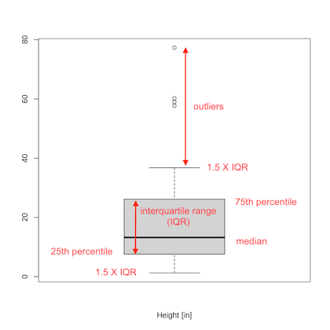
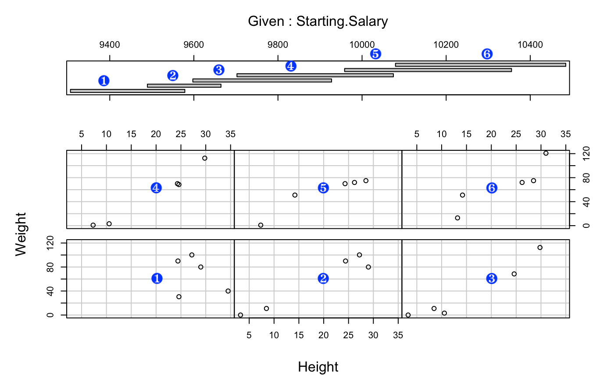

# Exploratory Data Analysis (EDA) in R

## Learning Outcomes

By the end of this workshop, you will be able to

- Load data into a data frame

- Assess general characteristics of your data (e.g. data types, column names)

- Generate descriptive statistics

- Quantify missingness and outliers

- Visualize univariate, bivariate and multivariate data.

- Identify potential relationships of interest which could be explored using modeling

We will use a dataset which has been handed to us by Barbara who works at NC State University. She has asked us to determine the following:

1.  What columns are in the data and what are their values?

2.  Are there any problems with the data? Outliers? Missing Values? Data type issues?

3.  What variance to you see in the individual values?

4.  What is the covariance between variables in the dataset?

5.  Does covariance between any variables lead to an interesting question?

Barbara would like reporting and visualization of the data. We have no additional information about the data except the following: units used in the data are inches, pounds, dollars and years.

## Install `tidyverse`

Let's start by installing, if needed, and loading the package of packages, `tidyverse`.

```{r}
#| label: load-tidyverse
#| output: FALSE


# If tidyverse isn't installed, install it
if (!require(tidyverse)) {
  install.packages("tidyverse")
}

# load tidyverse
library(tidyverse)

```

## Load Data

```{r}
#| label: load-data


# Create variable to hold file name of data
f.name <- "../data/EDA_Data_File_1.csv"

# read in data
data <- read.csv(f.name)

# Look at first few rows of data
head(data)
```

The `head()` function let's us look at the first 6 rows (by default) of our data. We can also look at the last 6, or even choose a different number of rows, using the `tail()` function.

```{r}
#| label: introduce-tail

# show the last 10 rows in data
tail(data, 10) 

```

## Summarize Data

### Shape & Type

The `glimpse()` function returns information about our data frame (the data structure that holds our data) including:

- the shape of our data, e.g. the number of rows and columns;

- column names, data type (\<chr\>, \<int\>, \<dbl\>) and a sample of values

```{r}
#| label: use-glimpse

glimpse(data)

```

In the notebook this looks messy, let's use our history file to call this in the console and see if it looks better. To do this:

- To the right, in the **Environment Pane**, click on the **History** tab.

- Scroll all the way to the bottom, the last command shown will be the last one your ran, either in the console or in your notebook.

- Click on `glimpse(data)` to select it.

- Just below the **History** tab, click on "To Console".

- Look in your **Console** window. Magic!! Click in the console window and hit enter to run the command.

------------------------------------------------------------------------

### Question: What do you notice about the data?

### POSSIBLE ANSWERS:

1.  There are 50 rows (observations) and 22 columns (variables)
2.  There is missing data.
3.  There is a mix of character and numeric data (\<int\> and \<dbl\>)

------------------------------------------------------------------------

### Values

We can use the `summary()` function to get information about each of our variables.

```{r}
#| label: use-summary

summary(data)

```

Again, the console will work better for output. The summary provides the following information:

**Character Data**

- Length: max \# of characters)\\

- N.unique: number of unique values

- N.blank: how many blank (missing? unknown?)

- Min.nchar: minimum length

- Max.nchar: maximum length

**Numeric Data**

- Min: minimum value

- 1st Qu.: first quartile value

- Median: median

- Mean: mean

- 3rd Qu: third quartile value

- Max: maximum value

> **A NOTE ABOUT BOOLEAN DATA (0/1)**
>
> Fields that contain boolean values (0/1) show interesting characteristics in a summary:
>
> - Min will be 0 and Max will be 1.
>
> - The mean will represent the percentage of rows for which the value is set to 1
>
>   For instance, The mean for Hired is 0.24 which means 24% of the rows have Hired set to 1.

------------------------------------------------------------------------

### Question: What do you notice about the summarized data?

### POSSIBLE ANSWERS:

1.  Some of the character data have 50 unique values.
2.  A few of the numeric fields have a lot of NAs.
3.  Weight is a character field.
4.  Dates are treated as character data, but years are not.

------------------------------------------------------------------------

[Next steps]{.underline}:

- identify variables for which we think missing data might be problematic
- assess whether the data type associated with a column make sense for the data stored in it

### Missing Data

We can explore missing data exclusively by using the `dplyr` package which is part of `tidyverse`. We want to extract the number of blanks in character data and the number of zeros or NAs in numeric data.

We will use the R pipe, `|>`. This will allow us to take the output of one command and pass it as the argument to the next. The `<-` operator assigns the value to a variable.

```{r}
#| label: missing-data

# Quantify the number of NAs and blanks in the data
missing_counts_dplyr <- data |>
  summarise(across(everything(), ~sum(is.na(.) | . == "")))

print(missing_counts_dplyr)

```

- `across()` applies a transformation across multiple columns in a data frame.
- `everything()` selects all variables
- `~sum(is.na(.) | . == "")` essentially sums either blanks or is.na() in the data where `.` represents a column. Functions used in this way (where the variable is not defined) is call an anonymous function.

### Changing Data Type(s)

#### Text to Numeric

From our summary we saw that `Weight` is character data. This is not an appropriate data type for a numeric value. Let's fix that.

```{r}
#| label: convert-weight

# Check values before changing
summary(data$Weight)

# Convert Weight to numeric value
# SHOULD WE SAVE THE ORIGINAL DATA? NAME NEW FIELD DIFFERENTLY?
data$Weight <- as.numeric(data$Weight)

  # Check converted data
glimpse(data$Weight)
summary(data$Weight)
```

> **WAIT!!**
>
> Where did the NA come from? Let's compare the character data to the numeric. Find where the NA is and then find it's location in the character data. What is the problem? Hmm.

We can fix this using the following code.

```{r}
#| label: fix-na-weight

# identify the row that has the NA value for weight
idx <- which(is.na(data$Weight))

# Replace NA with the correct numeric value 
data$Weight[idx] <- 1000.11 # What if more than 1 row/value needed to be fixed?

# Check the Weight vector
data$Weight
```

#### Text to Date

Another conversion we probably want to make is to convert text dates to a date format. Since we only want to convert a Date and not time information, we can use the `as.Date()` function.

```{r}
#| label: convert-to-date

# Convert Interview.Date to date format
data$Interview.Date <- as.Date(data$Interview.Date,
                                      format = "%Y-%m-%d")

# Check converted data
glimpse(data$Interview.Date)
summary(data$Interview.Date)

```

------------------------------------------------------------------------

### Question: How can we tell that our Interview.Date has been converted to a date?

### ANSWERS:

The summary shows numeric attributes, e.g. Min., 1st Qu., Median, Mean, 3rd Qu., and Max.

------------------------------------------------------------------------

### TRY IT!

Using the code above as a template, convert `Hire.Date` and `Termination.Date` from text to a date.

```{r}
#| label: try-text-to-date

# Hire.Date
data$Hire.Date <- as.Date(data$Hire.Date,
                               format = "%Y-%m-%d")

# Check converted data
glimpse(data$Hire.Date)
summary(data$Hire.Date)


# Termination.Date
data$Termination.Date <- as.Date(data$Termination.Date,
                          format = "%Y-%m-%d")

# Check converted data
glimpse(data$Termination.Date)
summary(data$Termination.Date)

```

#### Boolean Flags to Factor

There are three boolean fields in our data: `Offer.sent`, `Biter` and `Hired`. Boolean data frequently represent flags, which are categorical variables in practice. Factors let you associate a level and a label to a categorical variable. Converting a categorical variable to a factor can simplify analysis and visualization in R.

```{r}
#| label: convert-to-factor

# Offer.Sent
data$Offer.Sent <- factor(data$Offer.Sent,
                          levels = c(0,1),
                          labels = c("Offer Not Sent",
                                     "Offer Sent"))
# Check converted data
glimpse(data$Offer.Sent)
summary(data$Offer.Sent)

```

------------------------------------------------------------------------

### Questions:

1.  How can we find out what data type `Offer.Sent` is?
2.  What data type is it?
3.  Is **factor** a data type? (Hard question)
4.  Can we do math on this field?

### ANSWERS:

1.  You can use `typeof()` to see what data type `Offer.Sent` has.
2.  `typeof()` returns <integer>.
3.  Technically, a factor is a data object, we can see this by running `class(data$Offer.Sent)`. This command returns "factor" which indicates the class of the object.
4.  We can issues `sum(data$Offer.Sent)` to check if R sees this as a numeric value.

```{r}
#| label: factor-qs

# 1. and 2. Use typeof() to see what data type the field is
typeof(data$Offer.Sent)

# 3. We can use class() to see that Offer.Sent is and object of class "factor"
class(data$Offer.Sent)

# 4. We can use sum() to test whether we can do math on a factor Uncomment the line below to try it out.

# sum(data$Offer.Sent)

# We can use as.numeric() to force R to generate a sum. However, what does it mean?
sum(as.numeric(data$Offer.Sent))

# maybe this is more helpful
table(data$Offer.Sent)

```

------------------------------------------------------------------------

### TRY IT!

Using the code above as a template, convert `Biter` and `Hired` from `int` to a factor.

```{r}
#| label: try-int-to-factor


# Biter
data$Biter <- factor(data$Biter,
                     levels = c(0,1),
                     labels = c("Doesn't Bite",
                                "Bites"))
# Check converted data
glimpse(data$Biter)
summary(data$Biter)


# Hired
data$Hired <- factor(data$Hired,
                     levels = c(0,1),
                     labels = c("Not Hired",
                                "Hired"))
# Check converted data
glimpse(data$Hired)
summary(data$Hired)

```

#### Explore Character Data

We have many fields that store character data. In this section we'll explore ways to get more information about their contents. To do this, we first need to identify which columns in our data are character columns.

```{r}
#| label: find-char-cols

# identify character fields in our data
char.fields <- data |>
  select(where(is.character)) |> # a smaller df with character columns
  names()
print(char.fields)
```

> NOTE: This is the first time we have used the `tidyverse` pipe, `|>`. The pipe allows us to take the results of issuing a command on one line and pass the results to the command on the next. The code above takes `data` and passes it to the `select(where(is.character))` command. We then pass the output of the `select()` statement to the `names()` command. The results are stored in the `char.fields` variable.

We can look at the summary for a character fields and review how many blanks and unique values each has.

If a column has a lot of blanks, we might want to assess whether we need to get that data or not. The number of unique values will give us an idea of whether the field respresents groups (few blanks and a limited number of unique values) or individuals (few blanks and a lot of unique values). Columns with a lot of unique values will be harder, if not impossible, to visualize.

The following code will create a table of character variables, the number of unique values and the number of blanks each variable has and then sorts the table.

```{r}
#| label: identify-blanks-uniq

# Simplest way: call summary on the subset of character columns
summary(data[,char.fields])

# More complex way. Get only the data we want:
for (c in char.fields) {
  print(c) # print column name
  print(summary(c)[c(2,3)]) # print N.unique and N.blank only
}

```

------------------------------------------------------------------------

### Questions:

1.  What observations can we make about our character data?

### POSSIBLE ANSWERS:

1.  `Post.Employment.Position`, `Termination.Reason` and `Fur.Color` all have a small number of unique values but a large number of blanks.

2.  `Nick.Name` has more blanks than values. It has 21 non-blanks which have 15 unique values.

3.  `Temperment` has only 1 blank and 12 unique values.

4.  `Species`, `Prior.Employer`, `Prior Position`, and `Breed` have low numbers of missing values but many non-unique values.

5.  `Name` has no blanks and 50 unique values. For this data set, `Name` could be used as a unique identifier for a row.

For fields with a low to moderate number of unique values we can look at the unique values to get a sense of what they represent. To see the unique values we can use the `table()` command.

```{r}
#| label: find-unique-vals

table(data$Post.Employment.Position)

```

------------------------------------------------------------------------

### TRY IT!

Using the code above as a template, look at the unique values for `Termination.Reason`, `Fur.Color`, `Nick.Name`, and `Temperment`.

```{r}
#| label: try-table


# Termination Reason
table(data$Termination.Reason)

# Fur Color
table(data$Fur.Color)

# Nick Name
table(data$Nick.Name)

# Temperment
table(data$Temperment)

```

------------------------------------------------------------------------

For `Prior.Employer`, we can use a different method to explore unique values.

```{r}
#| label: method2-unique-vals

data |>
  distinct(Prior.Employer) |>
  select(Prior.Employer)
```

------------------------------------------------------------------------

### TRY IT!

Using the code above as a template, look at the unique values for `Prior.Position`.

```{r}
#| label: try-distinct-select


# Prior Position
data |>
  distinct(Prior.Position, .keep_all = TRUE) |>
  select(Prior.Position)


```

------------------------------------------------------------------------

## Visualize Data

### Univariate Data

#### Continuous

Appropriate visualizations for univariate continuous data include histograms and boxplots. Histograms give us information about the shape and spread of our data, showing us gaps, and modality. Boxplots, on the other hand give us a visual statistical summary of the data.

The fields in our data that are continuous are:

- Age
- Height
- Weight
- Starting.Salary

Let's compare the histogram and boxplot for Height.

**Histogram**

```{r}
#| label: height-histogram

# make a histogram of Height
hist(data$Height,
     xlab = "Height",
     main = "Histogram of Height")

```

------------------------------------------------------------------------

### Question:

What observations can we make from our histogram?

### POSSIBLE ANSWERS:

1.  Most of the heights occur below 10 inches.
2.  No heights occur between 40 and 50 inches
3.  A small number of weights are \> 50 inches
4.  The maximum height is 80 inches.

------------------------------------------------------------------------

Remember that histograms can be misleading if the number of bins or breaks are not enough. Let's increase the number of bins in our histogram of Height.

```{r}
#| label: increase-bins-histogram

hist(data$Height,
     breaks = 25, # this parameter lets us control the number of breaks/bins
     xlab = "Height (in)",
     main = "Histogram of Height"
)

```

------------------------------------------------------------------------

### Question:

What observations can we make from our histogram with more bins?

### POSSIBLE ANSWERS:

1.  There is more variation in Height \< 40 than is clear from the default histogram.
2.  The most observations occur around 5 in.
3.  We can now see a gap between the \# of observations around 60 vs. 80 inches.

------------------------------------------------------------------------

We can investigate the distribution of just the observations with height \< 40.

```{r}
#| label: height-lt-40

height.subset <- data |>
  filter(Height <= 40)

hist(height.subset$Height,
     xlab = "Height (in)",
     main = "Histogram of Height < 40 in.",
     breaks = 15)

```

This gives us a better picture of how height is distributed below 40 inches. We might want to extract a little more data about the values above 40. Since these do not constitute a large group we can easy extract some information that might help us determine the nature of these observations

```{r}
#| label: extract-gt-40

data |>
  filter(Height > 40) |>
  select('Name', 'Species', 'Breed', 'Height')
```

Well, this is interesting. While the values for Duke, Draco and Peanut are reasonable since they are horses, we do not expect Banjo to be taller than a horse! We should check into this value.

Next, let's compare the histogram to the boxplot.

**Boxplot**

Recall that a boxplot provides us with the following information:

{width="4in"}

Let's generate a boxplot for Height.

```{r}
#| label: create-boxplot

boxplot(data$Height,
        xlab = 'Height [in]')
```

------------------------------------------------------------------------

### Question:

What observations can we make from our boxplot?

### POSSIBLE ANSWERS:

1.  Four outliers occur above 50 inches.
2.  Heights are right tailed or left-skewed.
3.  50% of the data points occur below \~ 15 inches.
4.  No outliers occur in the lower region.

------------------------------------------------------------------------

### TRY IT!

Using the code provided in the histogram and boxplot sections. Visually explore the values for `Weight`, `Age` and `Starting.Salary`. If necessary "zoom in" to a range of data to get more information.

```{r}
#| label: try-hist-and-box

# Weight - Histogram
hist(data$Weight,
     xlab = "Weight (lbs)",
     main = "Histogram of Weight",
     breaks = 25)

# Weight - Boxplot
boxplot(data$Weight,
        xlab = "Weight (lbs)")

# Age - Histogram
hist(data$Age,
     xlab = "Age (yrs)",
     main = "Histogram of Age")

# Age - Boxplot
boxplot(data$Age,
        xlab = 'Age (yrs)')

# Starting Salary - Histogram
hist(data$Starting.Salary,
     xlab = "Starting Salary ($)",
     main = "Histogram of Starting Salary")


# Starting Salary - Boxplot
boxplot(data$Starting.Salary,
        xlab = 'Starting Salary ($)')


```

------------------------------------------------------------------------

#### Discrete or Categorical

We use bar plots for univariate categorical data. The following columns in our data frame are categorical and in order of number of unique values:

1.  Post.Employment.Position
2.  Termination.Reason
3.  Fur.Color
4.  Temperment
5.  Nick Name
6.  Species
7.  Prior.Employer
8.  Prior.Position
9.  Breed
10. Name

In addition we have our three variables that we converted to Factors: `Offer.Sent`, `Biter`, and `Hired`. These can be visualized the same way as other categorical variables.

We'll start with columns that don't have a lot of unique values. We won't bother making plots of `Nick.Name` or `Name` since they are labels for the data. Let's start with `Fur.Color`.

> NOTE: In order to create a bar plot, we need to generate the counts for each unique value in the column. We will use the `table()` function to provide that for us.

```{r}
#| label: first-barplot

# Generate counts
cnts <- table(data$Fur.Color)
cnts

# Generate bar plot
barplot(cnts)

```

There are some tweaks we can make to this which include adjusting the plot margins and flipping it so that we can see all the labels (notice the last bar is missing a label).

```{r}
#| label: improve-barplot

# Improve bar plot of Fur.Color

# Provide a label for blanks
names(cnts)
names(cnts)[1] <- "blank"

# change borders on plot by modifying
# the mar parameter
par(mar = c(4,7,1,1))
# mar = c(bottom, left, top, right)
# default par(mar = c(5.1, 4.1, 4.1, 2.1))
# unit in lines of text

# Generate bar plot
barplot(cnts,
        horiz = TRUE,
        las = 1, # controls the orientation of the text wrt the axis (0-3)
        cex.names = .75) # makes the font size 75% of default size

# reset mar()
par(mar = c(5.1, 4.1, 4.1, 2.1))
```

A final improvement would be to sort the counts from smallest to largest.

```{r}
#| label: small-2-large

# Group data by breed and create counts
val.counts <- data |>
  group_by(Fur.Color) |>
  count() |>
  arrange(n)

val.counts$Fur.Color[8] <- "blank"

# Set mar()
par(mar = c(4,7,1,1))

# Generate bar plot
barplot(val.counts$n,
              names.arg = val.counts$Fur.Color,
              xlab="Fur Color",
              horiz=TRUE,
              las = 1,
              cex.names = .75)

# reset mar()
par(mar = c(5.1, 4.1, 4.1, 2.1))
```

------------------------------------------------------------------------

### TRY IT!

Using the code above make some bar plots for other categorical fields in our data. Start we the basic code and then try some of the more advanced tricks we introduced. Remember to make a table of counts first!!

```{r}
#| label: try-it-barplots

# Temperment
val.counts <- data |>
  group_by(Temperment) |>
  count() |>
  arrange(n)

val.counts$Temperment[1] <- "blank"

barplot(val.counts$n,
        names.arg = val.counts$Temperment,
        horiz = TRUE,
        xlab = "Temperment",
        las = 1,
        cex.names = .5) # need to make text even smaller to fit everything!

# Species
barplot(table(data$Species),
        horiz = TRUE,
        las = 1,
        cex.names = .5) # need to make text even smaller to fit everything!

# Offer.Sent
barplot(table(data$Offer.Sent))

# Biter
barplot(table(data$Biter))

# Hired
barplot(table(data$Hired))

```

------------------------------------------------------------------------

#### Dates

Dates can be visualized as categorical variables by grouping them. Grouping over day, month, year or a combination may be informative.

Dates in our data include:

- Interview.Date
- Hire.Date
- Termination.Date

We can use functions like: `year()`, `month()`, `day()` and `wday()` to visualize different timescales. Remember we still have to use table to get the counts of the data at that scale.

```{r}
#| label: date-barplots

# Use year()
cnts <- table(year(data$Hire.Date))
barplot(cnts)

# Use month()
cnts <- table(month(data$Hire.Date))
barplot(cnts)

# Use day()
cnts <- table(day(data$Hire.Date))
barplot(cnts)

# Use wday()
cnts <- table(wday(data$Hire.Date, label=TRUE))
barplot(cnts)

# Use format to get YYYY-MM
yr.mnt <- format(data$Hire.Date, "%Y-%m")
cnts <- table(yr.mnt)
barplot(cnts,
        horiz = TRUE,
        las = 1)

```

------------------------------------------------------------------------

### TRY IT!

Using the code above make bar plots using the date functions shown above for our other date fields. Are the charts informative?

```{r}
#| label: try-it-date-charts

# Interview Date
cnts <- table(year(data$Interview.Date))
barplot(cnts,
        horiz = TRUE,
        las = 1,
        cex.names = .4)
# Is this chart helpful...not really
# maybe try other functions!

# Termination Date
cnts <- table(day(data$Termination.Date))
barplot(cnts)
# did you find a helpful chart by trying different date functions?
# I didn't... not enough information in this field.
```

### Bivariate Data

#### Pair Plots (Numerical Data)

Pair plots are an excellent way to identify interesting patterns between. To use it we must first extract numeric fields.

```{r}
#| label: pair-plots

# identify numeric fields in data
num.cols <- data |>
  select(where(is.numeric)) # a smaller df with character columns
names(num.cols)

pairs(num.cols)
```

The `pairs()` function in essence provides scatterplots in a grid that visualizes the relationship between every **pair** of numeric values.

#### Scatter Plots (2 Numerical Variables)

To investigate these relations further we can create a single scatter plot.

```{r}
#| label: scatter-plot

plot(data$Age, data$Starting.Salary,
     xlab = "Age",
     ylab = "Starting Salary ($)")
```

#### Bar charts (1 Categorical & 1 Numeric Variable)

```{r}
#| label: bar-chart-bivar

data2 <- data |>
  group_by(Hired) |>
  summarise(Salary = mean(Starting.Salary, na.rm = TRUE))

barplot(data2$Salary,
        names.arg = data2$Hired,
        ylab = "Average Starting Salary ($)"
        )


```

### Multivariate Plots

#### Scatter plot (2 Numerical and 1 Factor/Categorical)

> NOTE: Be sure to run the following code using the run button. Otherwise, you will get an annoying error.

```{r}
#| label: scatter-use-factor

# Using a factor

plt.colors <- c("red", "blue")

# Using a factor
plot(data$Weight, data$Height, # 2 numerical
     col = plt.colors[factor(data$Offer.Sent)], # 1 categorical
     pch = 19,
     xlab = "Weight (lbs)",
     ylab = "Height (in)",
)
legend('bottomright',
       legend = levels(factor(data$Offer.Sent)),
       col = plt.colors,
       pch = 19
)
```

```{r}
#| label: scatter-plot-multivar

# Create plot
plot(data$Weight, data$Height,
     pch = 19,
     col = as.factor(data$Species),
     xlab = "Weight (lbs)",
     ylab = "Height (in)")

legend('bottomright',
       legend = levels(as.factor(data$Species)),
       col = as.factor(levels(as.factor(data$Species))),
       cex = .6,
       bty = 'n',
       pch = 19)

```

#### Bar Chart (1 Numeric and 2 Factor/Categorical)

We can generate bar plots for multivariate data by using grouped or stacked bar charts. Note that making this type of plot work using a data frame is more compllicated than with previous plots. This is when you start considering to move to `ggplot2`.

```{r}
#| label: bar-chart-multivar

# generate a new data frame data by grouping date by two categorical variables
# and summarizing over a continuous variable
data2 <- data |>
  group_by(Temperment, Hired) |>
  summarise(Salary = mean(Starting.Salary, na.rm = TRUE)) |>
  drop_na() |>
  filter(Temperment != "") |>
  pivot_wider(
    names_from = Temperment, # The field with the most values.
    values_from = Salary,
    values_fill = 0
  )

# barplot() will work best with a matrix that has column and row names
# we will pull the row names for the first column of data.

# save row names in variable
r.names <- data2$Hired

# save the Salary values only as a matrix
data.matrix <- as.matrix(data2[ , 2:9])

# add row names to the new matrix
rownames(data.matrix) <- r.names

# use data to create bar chart

# Set mar()
par(mar = c(1, 8, 1, 8))

# Generate Plot
barplot(data.matrix,
        col = c("red","blue"),
        horiz = TRUE,
        las = 1,
        cex.names = .5)


# reset mar()
par(mar = c(5.1, 4.1, 4.1, 2.1))

```

#### Conditional Plots (Combination of Numerical and Categorical)

Coplots, or conditioning plots, can be used to generate scatter plots of two variables that are conditioned on 1 or 2 other variables. The code below generates an example.

```{r}
#| label: generate-coplot

# extract data for coplot
coplot.data <- data |>
  drop_na(Weight, Height, Starting.Salary) |>
  select(Weight, Height, Starting.Salary) |>
  arrange(Starting.Salary, Weight, Height)

# generate coplot
coplot(Weight ~ Height | Starting.Salary, data = coplot.data)

```

The top graph shows ranges of salary for which the plots below are partitioned. The plots reflect the ranges from bottom left to top right. The image below shows which plots the salary ranges are associated with. Note that you can use categorical variables and can add another conditioning variable as well. See more information and examples at [R coplots](https://intro2r.com/simple-base-r-plots.html#coplots "R coplots").



The `co.intervals()` function lets us control the number of intervals and the overlap between intervals for continuous variables. Below, we reduce the number of intervals to 4 and restrict the overlap to 33%.

```{r}
#| label: modify-coplot

# revise intervals for Starting Salary
given.salary <- co.intervals(coplot.data$Starting.Salary,
                             number=4, overlap=.33)

# regenerate plot using new intervals
coplot(Weight ~ Height | Starting.Salary, data = coplot.data,
       given.values = given.salary)

```

## Next Steps

We have explored the data quite a bit. Next steps would be to identify one or two relationships to explore further. This may involve subsetting the data further or using simple models like linear (continuous, fairly normal response) or logistic regression (binary/boolean response).

What relationships or trends do you think might be interesting?

Based on the data, **what job do you think Barbara has at NC State?**

**TRY IT ON YOUR OWN!**

Using the code above try exploring another data set. Explore the data to determine what the data represents and to find interesting relationships between the variables, if any. If you encounter questions as you try this, don't hesitate to reach out to [go.ncsu.edu/getdatahelp](https://go.ncsu.edu/getdatahelp). You can email your questions, or one of our consultants would be happy to meet with you in person or over Zoom.

```{r}

new.data <- read.csv("../data/EDA_Data_File_2.csv")
```

## Links to additional resources

### R

[R for Data Science](https://www.google.com/url?q=https%3A%2F%2Fr4ds.hadley.nz%2F)

[Introduction to R](https://www.google.com/url?q=https%3A%2F%2Fintro2r.com%2F)

### Base R Plots

[Intro2R](https://www.google.com/url?q=https%3A%2F%2Fintro2r.com%2Fgraphics_base_r.html)

[STHDA](https://www.google.com/url?q=https%3A%2F%2Fwww.sthda.com%2Fenglish%2Fwiki%2Fr-base-graphs)
