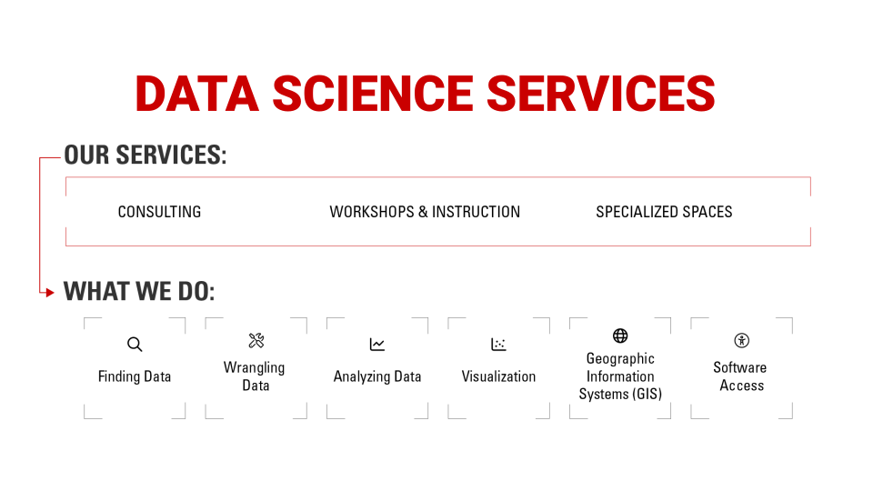
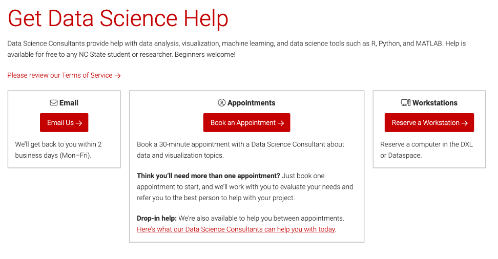
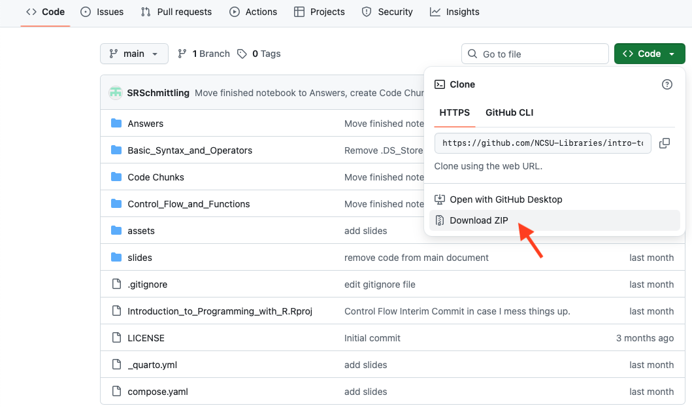
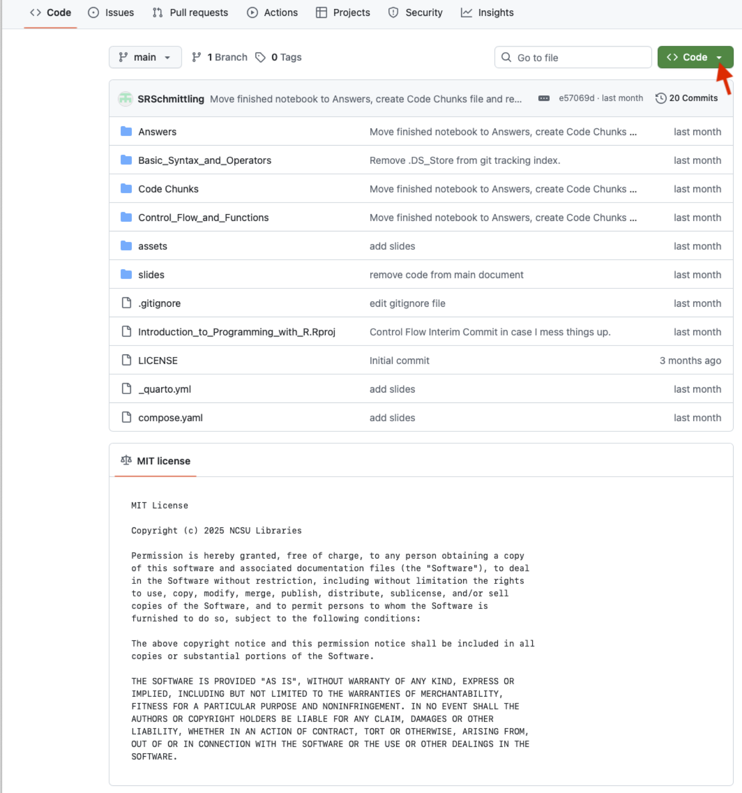

## Welcome

Slides: <a href="https://go.ncsu.edu/intro-prog-r-slides" target="_blank"><strong>https://go.ncsu.edu/intro-to-prog-r</strong></a> 

To get a complete from this session:

-   In-person: Sign the attendance sheet
-   Virtual: We will use Zoom attendance

------------------------------------------------------------------------

## Who is this workshop for?

::: {style="font-size: 0.92em;"}
<ul>

<li>R beginners with little to no experience</li>

<li>People who are excited about analyzing data using R</li>

<li>People who need to analyze their data using R</li>

<li>Future coders</li>

</ul>
:::

------------------------------------------------------------------------

## Today we will learn R basics {.incremental}

-   Access notebooks in R
-   Variables
-   Data types: numeric, string, date/time, logic
-   Data structures: lists, dictionaries
-   Operators: arithmetic, relational, logical
-   Q&A and next steps

------------------------------------------------------------------------



------------------------------------------------------------------------

## Who we are {.team-slide}

::::::::::::::::::::: team-grid
::::: person


::: name
<strong>Mara Blake</strong>
:::

::: role
Head, Data Science Services
:::
:::::

::::: person


::: name
<strong>Shannon Ricci</strong>
:::

::: role
Associate Head, Data Science Services
:::
:::::

::::: person


::: name
<strong>Jeff Essic</strong>
:::

::: role
Lead Librarian for GIS
:::
:::::

::::: person


::: name
<strong>Alp Tezbasaran</strong>
:::

::: role
Data Science Librarian
:::
:::::

::::: person


::: name
<strong>Selene Schmittling</strong>
:::

::: role
Data Science Librarian
:::
:::::

::::: person


::: name
<strong>Lynnee Argabright</strong>
:::

::: role
Data Science Teaching Librarian
:::
:::::
:::::::::::::::::::::

::: team-summary
Our team comes from a variety of academic backgrounds, including nuclear engineering, electrical engineering, marine ecology, history, information science, natural resources, and geographic information sciences.
:::

------------------------------------------------------------------------

## Check our workshops

[<a href="https://go.ncsu.edu/datavizworkshops" style="color: #CC0000; text-decoration: underline;">go.ncsu.edu/datavizworkshops</a>]{style="color: #CC0000; padding: 2px 6px; border-radius: 4px; font-weight: bold;"} 

::: {.nonincremental style="font-size: 1.7rem; line-height: 1.2;"}
-   Introduction to Programming with Python \[R\]: Basic Syntax and Operators
-   Introduction to Programming with Python \[R\]: Control Flow and Functions
-   Map, analyze, and share spatial data
-   Introduction to Creating Publication-Quality Visualizations
-   Getting Started with Data Publication: What, Why, and How
:::

Have workshop ideas? Contact us!

------------------------------------------------------------------------

### How to contact us

[<a href="https://go.ncsu.edu/getdatahelp" style="color: #CC0000; text-decoration: underline;">go.ncsu.edu/getdatahelp</a>]{style="color: #CC0000; padding: 2px 6px; border-radius: 4px; font-weight: bold;"}



Direct email: <a href="mailto:getdatahelp@ncsu.edu">getdatahelp\@ncsu.edu</a>

------------------------------------------------------------------------

### How to access workshop material?

::::: columns
::: {.column width="50%" style="font-size: 1.7rem; line-height: 1.1;"}
1.  Go to <br> <a href="https://go.ncsu.edu/intro-to-prog-R" target="_blank">https://go.ncsu.edu/intro-to-prog-py</a>
2.  Click on `Code`.
3.  Click on `Download .zip`. 
4.  Download file to location of your choice.
5.  Go to the saved directory and double-click on \`Introduction_to_Programming_with_R.Rproj"
:::

::: {.column width="50%"}

:::
:::::

------------------------------------------------------------------------

### How to contact us

[<a href="https://go.ncsu.edu/getdatahelp" style="color: #CC0000; text-decoration: underline;">go.ncsu.edu/getdatahelp</a>]{style="color: #CC0000; padding: 2px 6px; border-radius: 4px; font-weight: bold;"}


Direct email: <a href="mailto:getdatahelp@ncsu.edu">getdatahelp\@ncsu.edu</a>

------------------------------------------------------------------------

## Continue learning R!

-   NC State University Libraries workshops
-   LinkedIn Learning: lots of R courses!
-   

------------------------------------------------------------------------

### Tell us how we did

[go.ncsu.edu/dss-workshop-eval](https://go.ncsu.edu/dss-workshop-eval) <!-- qr_eval -->

<p style="text-align: left;">


</p>

<p class="thank-you-inline">

THANK YOU

</p>

::: hidden
```{=html}
<script>
  document.addEventListener('DOMContentLoaded', () => {
    const title = document.querySelector('.reveal .slides section .title, .reveal .slides section h1, .reveal .slides section h2');
    const workshop = title ? title.textContent.trim() : 'Workshop';
    document.body.setAttribute('data-workshop', workshop);
  });
</script>
```
:::
